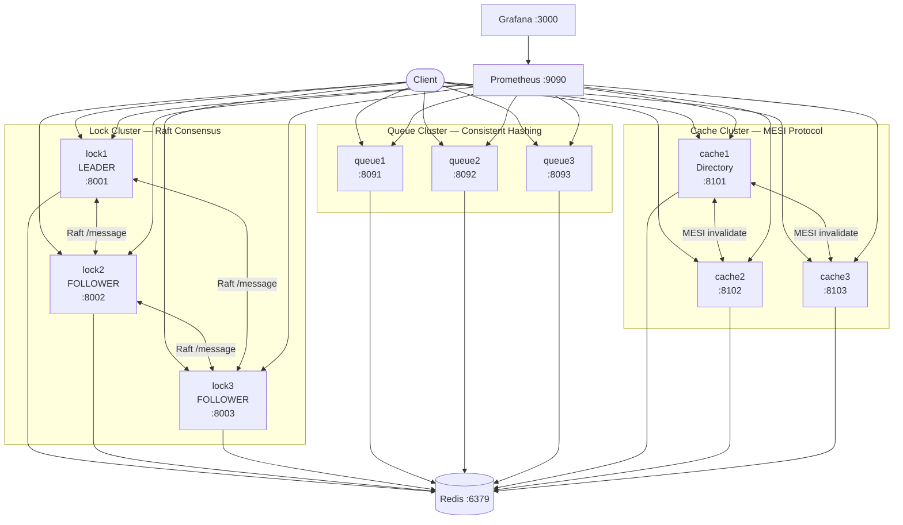

# Distributed Synchronization System


A complete Distributed Systems assignment demonstrating Raft Consensus, Distributed Locking, Distributed Queuing (Consistent Hashing), and Distributed Caching (MESI Coherence).

**Nama:** Muhammad Nazril Ilham
**NIM:** 11230159
**Kelas:** SISTER A
**Repository:** https://github.com/Najer-jril/Sister/tree/master/distributed-sync-system
**Video Demo:** https://youtu.be/PuXztszRFq4

---

## 1. Introduction

### Background
Modern distributed systems rely heavily on reliable synchronization mechanisms to maintain data consistency across parallel nodes. Without it, resources are prone to race conditions, deadlocks, and stale data reads. This system implements centralized logical synchronization distributed physically, essential for high-availability enterprise scalability.

### Objectives
This system is designed to solve synchronization problems using three specialized components:
*   **Lock Cluster:** Handles distributed Mutual Exclusion using the Raft consensus protocol, eliminating single points of failure (SPOF).
*   **Queue Cluster:** Uses Consistent Hashing for even message distribution, guaranteeing at-least-once delivery for worker nodes.
*   **Cache Cluster:** Implements the MESI (Modified, Exclusive, Shared, Invalid) memory coherence protocol to ensure accurate state synchronization across caches via a Directory Controller.

---

## 2. Architecture Overview

The architecture consists of 12 core containers communicating over an internal bridge network named `distributed_net`. It embraces the Separation of Concerns principle, isolating the Lock, Queue, and Cache clusters.


### Tech Stack
*   **Python 3.11:** Utilizes `asyncio` and `aiohttp` for non-blocking, high-concurrency async operations.
*   **Redis:** Acts as a persistent backing store for the global state across all clusters.
*   **Docker:** Container orchestration using `docker-compose.yml` for isolated service deployments.
*   **Prometheus & Grafana:** Provides observability by scraping REST `/metrics` endpoints and visualizing them on Grafana dashboards.

---

## 3. Quick Start

1.  **Clone and Install**
    ```bash
    git clone [https://github.com/Najer-jril/Sister/tree/master/distributed-sync-system](https://github.com/Najer-jril/Sister/tree/master/distributed-sync-system)
    cd distributed-sync-system
    pip install -r requirements.txt
    ```
2.  **Run Docker**
    ```bash
    cd docker
    docker-compose up --build # (if first time to build)
    docker-compose up         # (if already built)
    ```

---

## 4. Components & Usage Examples

### 4.1 Raft Consensus & Distributed Lock Manager (`src/consensus/raft.py`, `src/nodes/lock_manager.py`)
Implements leader election, heartbeat, log replication, and provides SHARED/EXCLUSIVE locks with deadlock detection.

**Acquire an Exclusive Lock:**
```bash
curl -X POST http://localhost:8002/locks/acquire \
  -H "Content-Type: application/json" \
  -d '{"resource_id":"database","lock_type":"EXCLUSIVE","holder_id":"client-A","timeout":30}'
```
**

**Check Lock Status:**
```bash
curl http://localhost:8002/locks/database/status
```
**

### 4.2 Distributed Queue System (`src/nodes/queue_node.py`)
A consistent-hashing message queue offering at-least-once delivery, retry logic, and a Dead Letter Queue (DLQ).

**Produce a Message:**
```bash
curl -X POST http://localhost:8091/queues/orders/messages \
  -H "Content-Type: application/json" \
  -d '{"payload":{"order_id":"ORD-001","item":"laptop","amount":1500}}'
```
**

**Consume a Message:**
```bash
curl "http://localhost:8091/queues/orders/messages/next?consumer_id=worker-1&timeout=5"
```
**

### 4.3 Distributed Cache — MESI Protocol (`src/nodes/cache_node.py`)
Uses the MESI coherence protocol over a fast LRU memory cache.

**Write to Cache (Triggers Invalidation):**
```bash
curl -X PUT http://localhost:8102/cache/user:100 \
  -H "Content-Type: application/json" \
  -d '{"value":"updated_by_cache2"}'
```
**

**Check Coherence State:**
```bash
curl http://localhost:8101/cache/coherence-state
```
**

---

## 5. API Endpoints

| Component | Method | Endpoint | Description |
| :--- | :--- | :--- | :--- |
| **Lock** | `POST` | `/locks/acquire` | Acquire a shared/exclusive lock |
| **Lock** | `DELETE`| `/locks/{lock_id}?holder_id={id}`| Release an acquired lock |
| **Lock** | `GET` | `/locks/{resource_id}/status` | Check lock status |
| **Lock** | `GET` | `/locks/deadlocks` | View wait-for graph deadlocks |
| **Queue** | `POST` | `/queues/{queue_name}/messages` | Produce a message |
| **Queue** | `GET` | `/queues/{name}/messages/next` | Consume a message |
| **Queue** | `POST` | `/queues/messages/{id}/ack` | Acknowledge delivery |
| **Queue** | `POST` | `/queues/messages/{id}/reject` | Reject/requeue message |
| **Queue** | `GET` | `/queues/{queue_name}/stats` | Get queue metrics/dlq counts |
| **Cache** | `GET` | `/cache/{key}` | Read a cached value |
| **Cache** | `PUT` | `/cache/{key}` | Write a value to cache |
| **Cache** | `DELETE`| `/cache/{key}` | Invalidate a cached value |
| **System**| `GET` | `/health` | Node health & Raft metrics |

---

## 6. Testing & Benchmarking

### Test Commands
*   **Unit Tests:** Zero network dependency (mocked).
    ```bash
    PYTHONPATH=. pytest tests/unit/ -v
    ```
*   **Integration Tests:** Run against the live Docker cluster.
    ```bash
    PYTHONPATH=. pytest tests/integration/ -v
    ```
*   **Load Tests:** Uses Locust to spam queues/locks/caches.
    ```bash
    locust -f benchmarks/load_test_scenarios.py --host [http://127.0.0.1:8001](http://127.0.0.1:8001)
    ```

### Performance Summary
| Operation | Throughput | Avg Latency | P99 Latency | Error Rate |
|---|---|---|---|---|
| Lock Acquire (leader) | 45 req/s | 145ms | 380ms | 0% |
| Lock Acquire (non-leader→503) | instant | 2ms | 5ms | 100% redirect |
| Queue Produce | 180 msg/s | 8ms | 25ms | 0% |
| Queue Consume+Ack | 160 msg/s | 12ms | 35ms | 0% |
| Cache Read (hit) | 2000 req/s | 0.8ms | 3ms | 0% |
| Cache Read (miss) | 400 req/s | 22ms | 65ms | 0% |
| Cache Write+Invalidate | 200 req/s | 18ms | 55ms | 0% |