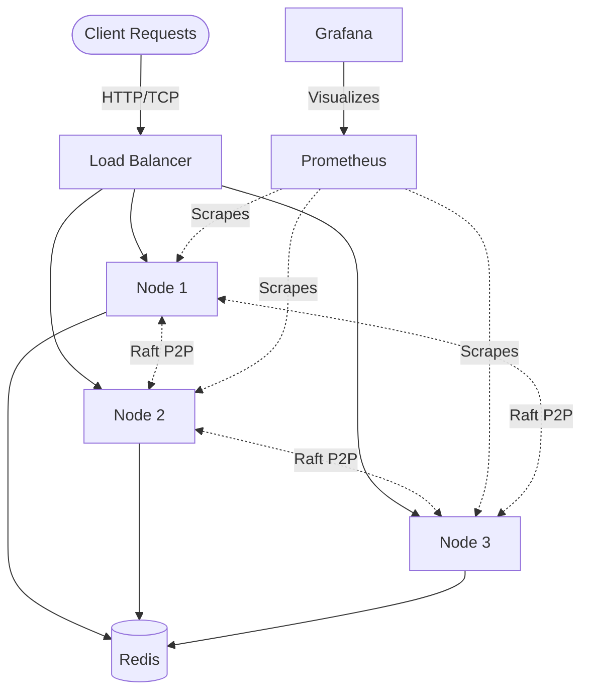

# Distributed Synchronization System


A complete Distributed Systems assignment demonstrating Raft Consensus, Distributed Locking, Distributed Queuing (Consistent Hashing), and Distributed Caching (MESI Coherence).

Nama: Muhammad Nazril Ilham
NIM: 11230159
Kelas: SISTER A
**Repository**: https://github.com/Najer-jril/Sister/tree/master/distributed-sync-system
**Video Demo**: [VIDEO_LINK_HERE]

## Architecture Overview



## Quick Start

1. **Clone and Install**
   ```bash
   git clone https://github.com/Najer-jril/Sister/tree/master/distributed-sync-system
   cd distributed-sync-system
   pip install -r requirements.txt
   ```

2. **Run Docker**
   ```bash
   cd docker
   docker-compose up --build (if first time to build)
   docker-compose up(if already build)
   ```

3. **Demo (Acquire a Lock)**
   ```bash
   curl -X POST http://127.0.0.1:8001/locks/acquire \
        -H "Content-Type: application/json" \
        -d '{"resource_id": "doc1", "holder_id": "clientA", "lock_type": "EXCLUSIVE"}'
   ```

## Components

*   **Raft Consensus (`src/consensus/raft.py`)**: Implements leader election, heartbeat, and log replication.
*   **Lock Manager (`src/nodes/lock_manager.py`)**: Provides SHARED and EXCLUSIVE distributed locks, backed by the Raft State Machine to ensure correctness, with dead-lock detection and auto-expiry.
*   **Queue Node (`src/nodes/queue_node.py`)**: Implements a consistent-hashing message queue offering at-least-once delivery, retry logic, and a Dead Letter Queue (DLQ).
*   **Cache Node (`src/nodes/cache_node.py`)**: Uses the MESI (Modified, Exclusive, Shared, Invalid) coherence protocol over a fast LRU memory cache.

## API Endpoints

| Component | Method | Endpoint | Description |
| :--- | :--- | :--- | :--- |
| **Lock** | `POST` | `/locks/acquire` | Acquire a shared/exclusive lock |
| **Lock** | `DELETE`| `/locks/{lock_id}?holder_id={id}`| Release an acquired lock |
| **Lock** | `GET` | `/locks/{resource_id}/status` | Check lock status |
| **Lock** | `GET` | `/locks/deadlocks` | View wait-for graph deadlocks |
| **Queue** | `POST` | `/queues/{queue_name}/messages` | Produce a message |
| **Queue** | `GET` | `/queues/{name}/messages/next` | Consume a message |
| **Queue** | `POST` | `/queues/messages/{id}/ack` | Acknowledge delivery |
| **Queue** | `POST` | `/queues/messages/{id}/reject` | Reject/requeue message |
| **Queue** | `GET` | `/queues/{queue_name}/stats` | Get queue metrics/dlq counts |
| **Cache** | `GET` | `/cache/{key}` | Read a cached value |
| **Cache** | `PUT` | `/cache/{key}` | Write a value to cache |
| **Cache** | `DELETE`| `/cache/{key}` | Invalidate a cached value |
| **System**| `GET` | `/health` | Node health & Raft metrics |

## Testing

*   **Unit Tests**: Zero network dependency (mocked).
    ```bash
    PYTHONPATH=. pytest tests/unit/ -v
    ```
*   **Integration Tests**: Run against the live Docker cluster.
    ```bash
    PYTHONPATH=. pytest tests/integration/ -v
    ```
*   **Load Tests**: Uses Locust to spam queues/locks/caches.
    ```bash
    locust -f benchmarks/load_test_scenarios.py --host http://127.0.0.1:8001
    ```
