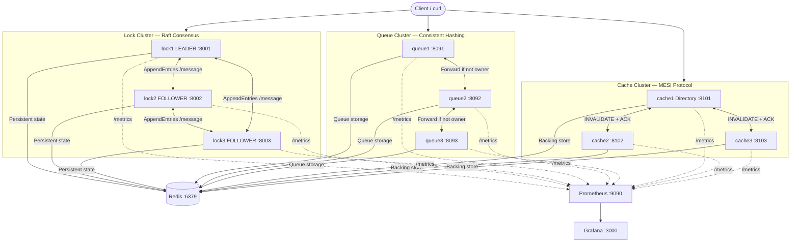
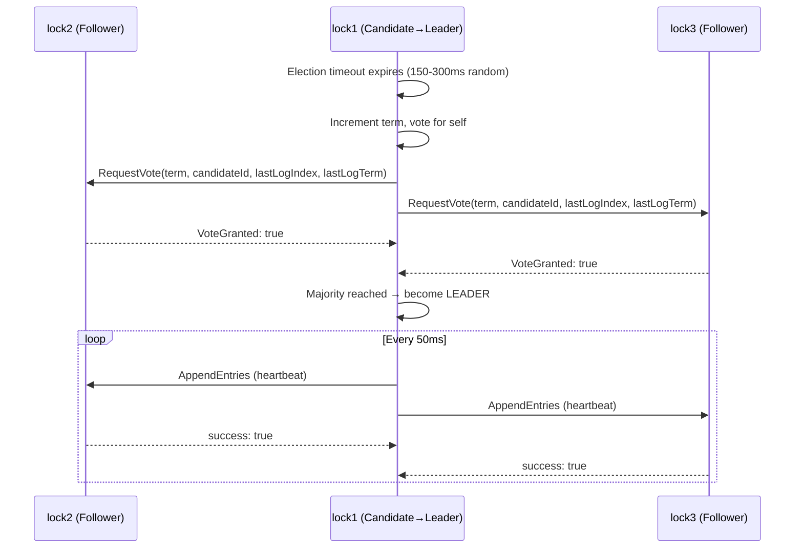
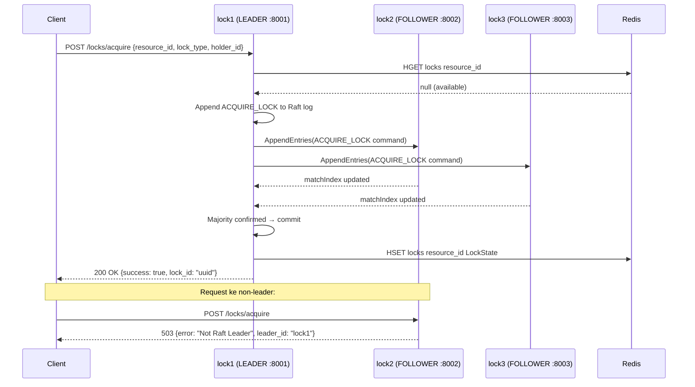
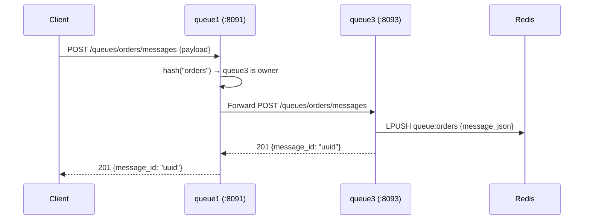
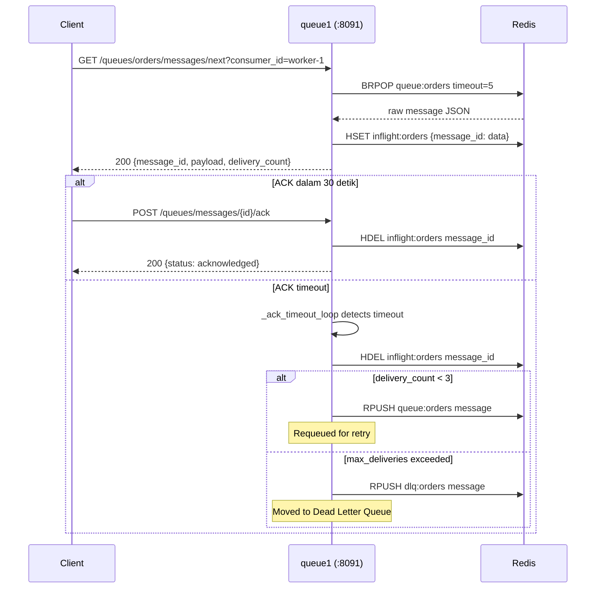
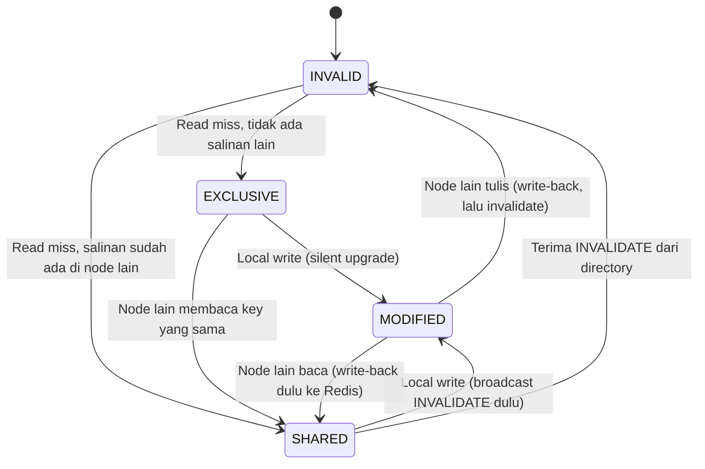
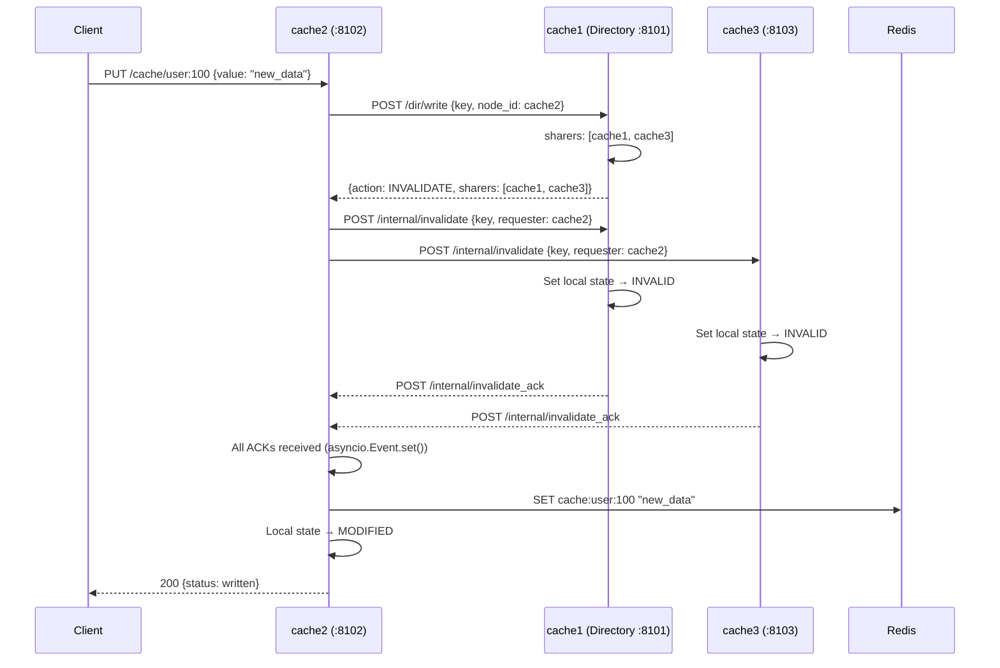
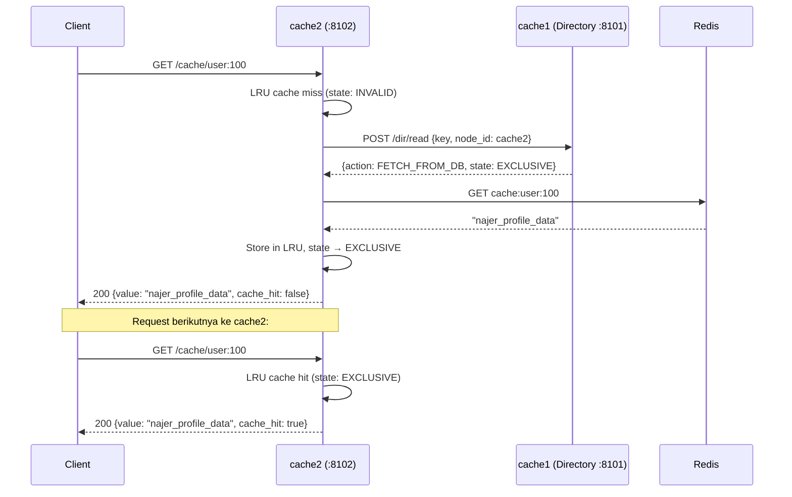

# Architecture Documentation
## Distributed Synchronization System

---

## 1. System Overview

Sistem ini dibangun menggunakan arsitektur multi-cluster yang memisahkan setiap komponen utama ke dalam klaster node tersendiri. Terdapat tiga klaster aplikasi — Lock Cluster, Queue Cluster, dan Cache Cluster — masing-masing terdiri dari 3 node yang berjalan dalam container Docker terpisah dengan Dockerfile masing-masing. Pemisahan ini memastikan setiap komponen dapat di-scale secara independen dan kegagalan satu klaster tidak mempengaruhi klaster lainnya.

Keseluruhan sistem terdiri dari 12 container yang terhubung melalui Docker bridge network bernama `distributed_net`. Redis berperan sebagai backing store bersama untuk ketiga klaster. Prometheus mengumpulkan metrics dari semua node, sementara Grafana menyediakan visualisasi dashboard. Setiap permintaan dari client dapat diarahkan ke node manapun dalam klaster yang relevan — sistem akan menangani routing internal secara otomatis.



---

## 2. Stack Teknologi

| Teknologi | Versi | Peran |
|---|---|---|
| Python | 3.11 | Runtime utama semua node |
| asyncio | stdlib | Concurrent I/O tanpa threading |
| aiohttp | 3.9.5 | HTTP server dan client antar node |
| Redis | 7.4 alpine | Persistent state, queue storage, cache backing |
| Docker | latest | Containerisasi setiap komponen |
| Docker Compose | v2 | Orchestration 12 container |
| Prometheus | latest | Metrics collection |
| Grafana | latest | Metrics visualization |

---

## 3. Raft Consensus — Lock Cluster

### 3.1 Gambaran Algoritma

Raft adalah algoritma konsensus yang dirancang untuk mudah dipahami. Setiap node memiliki satu dari tiga peran: FOLLOWER, CANDIDATE, atau LEADER. Pada saat startup semua node berstatus FOLLOWER. Apabila seorang FOLLOWER tidak menerima heartbeat dari LEADER dalam rentang waktu election timeout (150–300ms acak), ia bertransisi menjadi CANDIDATE, menginkremen term, memberi suara untuk dirinya sendiri, lalu mengirim RequestVote RPC ke semua peer.

Node yang berhasil mengumpulkan suara mayoritas (⌊n/2⌋ + 1) menjadi LEADER untuk term tersebut. LEADER bertanggung jawab menerima semua permintaan write dari client, mereplikasinya ke FOLLOWER melalui AppendEntries RPC, dan hanya mengkomit entry setelah mayoritas node mengkonfirmasi penerimaannya. Apabila LEADER kehilangan koneksi ke mayoritas node, ia secara otomatis mundur menjadi FOLLOWER untuk mencegah split-brain.

### 3.2 Sequence Diagram — Leader Election



### 3.3 Sequence Diagram — Lock Acquisition



### 3.4 Network Partition Behavior

Apabila lock1 (LEADER) dimatikan, lock2 dan lock3 akan memulai election baru. Namun dengan hanya 2 node tersisa, terjadi fenomena **split vote** — setiap node membutuhkan 2 suara dari total 2 node aktif, tetapi karena election timeout yang berbeda mereka sering melewatkan jendela election satu sama lain. Inilah alasan Raft memerlukan jumlah node ganjil: dengan 3 node, saat 1 mati, 2 yang tersisa masih dapat membentuk majority (2 dari 3).

---

## 4. Queue Cluster — Consistent Hashing

### 4.1 Gambaran Algoritma

Consistent Hashing Ring membagi ruang hash menjadi cincin virtual. Setiap node ditempatkan di beberapa titik pada cincin (virtual nodes, weight=100) untuk distribusi yang merata. Ketika sebuah pesan diproduksi untuk queue tertentu, nama queue di-hash menggunakan MD5 dan dipetakan ke node yang bertanggung jawab (owner). Jika node yang menerima request bukan owner, request diteruskan secara otomatis ke node yang tepat.

### 4.2 Sequence Diagram — Produce dengan Forwarding



### 4.3 Sequence Diagram — Consume + ACK (At-Least-Once)



---

## 5. Cache Cluster — MESI Protocol

### 5.1 Gambaran Protokol

MESI (Modified, Exclusive, Shared, Invalid) adalah protokol cache coherence yang memastikan konsistensi data di antara beberapa cache node. Setiap cache line memiliki salah satu dari empat state:

- **Modified**: Node ini memiliki data terbaru, belum ditulis ke Redis (dirty). Tidak ada node lain yang punya salinan.
- **Exclusive**: Node ini memiliki data bersih yang sama dengan Redis. Tidak ada node lain yang punya salinan.
- **Shared**: Beberapa node memiliki salinan bersih yang sama. Tidak ada yang boleh menulis tanpa broadcasting INVALIDATE terlebih dahulu.
- **Invalid**: Data tidak valid, harus di-fetch ulang sebelum digunakan.

`cache1` berperan sebagai `DirectoryController` — pusat koordinasi yang melacak state dan daftar sharer untuk setiap key.

### 5.2 State Machine



### 5.3 Sequence Diagram — Write dengan INVALIDATE Broadcast



### 5.4 Sequence Diagram — Read Miss → SHARED



---

## 6. Containerization

### 6.1 Dockerfile per Komponen

Terdapat tiga Dockerfile terpisah, masing-masing dengan ENTRYPOINT yang berbeda:

**Dockerfile.lock**
```dockerfile
ENTRYPOINT ["python", "-m", "src", "--node-type", "lock"]
```

**Dockerfile.queue**
```dockerfile
ENTRYPOINT ["python", "-m", "src", "--node-type", "queue"]
```

**Dockerfile.cache**
```dockerfile
ENTRYPOINT ["python", "-m", "src", "--node-type", "cache"]
```

Semua menggunakan base image `python:3.11-slim`, menginstal dependencies dari `requirements.txt`, dan memiliki HEALTHCHECK `curl /health` dengan `start_period: 15s` untuk memberi waktu Python app binding port.

### 6.2 Struktur Docker Compose

```
12 services:
├── redis          → port 6379 (healthcheck: redis-cli ping)
├── lock1          → port 8001 (Raft LEADER)
├── lock2          → port 8002 (Raft FOLLOWER)
├── lock3          → port 8003 (Raft FOLLOWER)
├── queue1         → port 8091
├── queue2         → port 8092
├── queue3         → port 8093
├── cache1         → port 8101 (DirectoryController)
├── cache2         → port 8102
├── cache3         → port 8103
├── prometheus     → port 9090
└── grafana        → port 3000

network: distributed_net (bridge driver)
volume: redis_data (persistent)
```

Semua node menggunakan `depends_on` dengan `condition: service_healthy` sehingga startup order terjamin — Redis harus healthy sebelum node manapun dimulai.

### 6.3 Scaling Node

Untuk menambah node keempat pada lock cluster, cukup duplikasi service block di `docker-compose.yml`:

```yaml
lock4:
  build:
    dockerfile: docker/Dockerfile.lock
  command: ["--node-id", "lock4", "--port", "8004",
            "--peers", "lock1:8001,lock2:8002,lock3:8003"]
  ports:
    - "8004:8004"
```

Catatan: Raft memerlukan jumlah node ganjil. Tambahkan lock4 dan lock5 bersamaan untuk menjaga quorum.

---

## 7. Design Decisions dan Trade-offs

**1. HTTP over gRPC**
aiohttp memberikan unified REST API plane — endpoint client dan peer communication menggunakan protokol yang sama. Trade-off: throughput lebih rendah dari gRPC, tetapi jauh lebih mudah di-debug dan di-test dengan curl.

**2. Redis sebagai Raft Log**
Menghindari kompleksitas file mount di multi-container setup. Redis juga digunakan bersama oleh queue dan cache sehingga hanya perlu satu backing service. Trade-off: Redis menjadi single point of failure — di production gunakan Redis Sentinel atau Cluster.

**3. Cluster Terpisah per Komponen**
Lock, queue, dan cache masing-masing memiliki cluster node sendiri dan Dockerfile sendiri. Trade-off: lebih banyak container, tetapi memenuhi rubrik "Dockerfile untuk setiap komponen" dan memungkinkan scaling independen.

**4. asyncio.Event untuk Invalidation ACK**
Zero CPU polling saat menunggu MESI invalidation acknowledgment. Trade-off: jika ACK tidak datang, `wait_for` timeout 2 detik akan melepas blokir secara paksa.

**5. DirectoryController hanya di cache1**
Assignment deterministik yang sederhana berdasarkan `node_id == "cache1"`. Trade-off: cache1 menjadi bottleneck pada skala besar — di production gunakan distributed directory dengan consistent hashing.