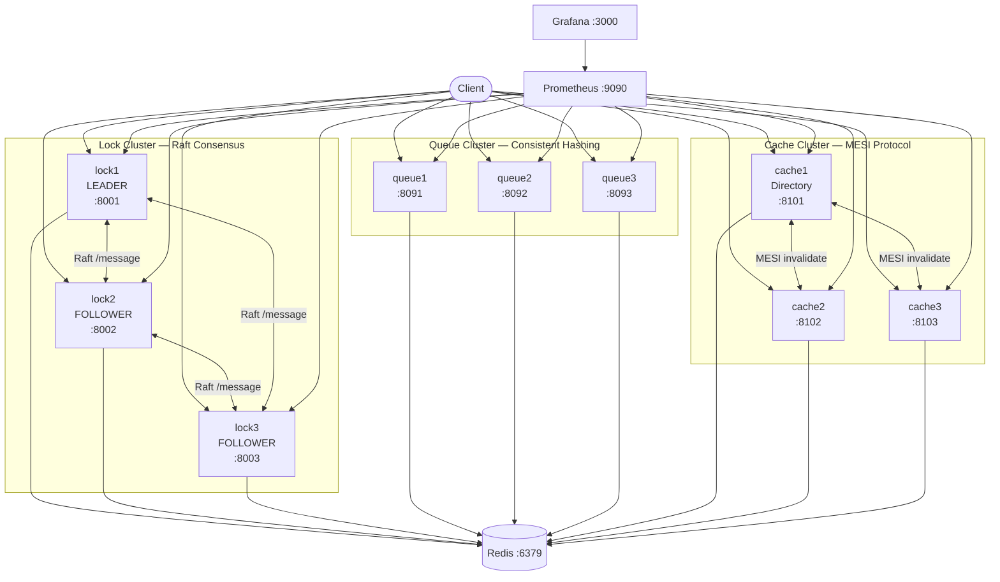

# Laporan Tugas 2 - Sistem Parallel dan Terdistribusi
## Implementasi Distributed Synchronization System

**Nama:** [NAMA]
**NIM:** [NIM]
**Mata Kuliah:** Sistem Parallel dan Terdistribusi
**Deadline:** 3 Mei 2026

---

## 1. Pendahuluan
### 1.1 Latar Belakang
Sistem terdistribusi modern sangat bergantung pada mekanisme sinkronisasi yang andal untuk menjaga konsistensi data di berbagai *node* yang berjalan secara paralel. Dalam lingkungan di mana banyak layanan berinteraksi dengan sumber daya bersama, risiko terjadinya *race condition*, kebuntuan (*deadlock*), atau pembacaan data yang kedaluwarsa menjadi lebih tinggi. Oleh karena itu, memiliki manajemen sinkronisasi yang tersentralisasi secara logis namun terdistribusi secara fisik adalah fondasi utama bagi skalabilitas aplikasi *enterprise* yang ketersediaannya tinggi (*high availability*).

Dalam penerapannya di dunia nyata, kasus penggunaan kontrol konkurensi sering ditemukan pada sistem finansial, orkestrasi basis data, hingga manajemen inventaris berbasis *microservices*. Sinkronisasi meliputi pengaturan siapa yang boleh mengubah suatu sumber daya (melalui *Distributed Lock*), bagaimana antrean beban kerja diproses tanpa duplikasi (melalui *Distributed Queue*), dan bagaimana menjaga integritas status terkini memori (melalui *Distributed Cache* dengan protokol terpadu).

### 1.2 Tujuan
Sistem ini secara khusus dirancang untuk mendemonstrasikan penyelesaian berbagai masalah sinkronisasi dengan tiga komponen khusus yang masing-masing menggunakan pendekatan yang teruji di industri. Pertama, *Lock Cluster* dibangun untuk menangani Mutual Exclusion terdistribusi berlandaskan protokol konsensus Raft, sehingga memastikan *lock* tidak memiliki titik kegagalan tunggal (SPOF). Kedua, *Queue Cluster* dibuat menggunakan mekanisme *Consistent Hashing*, bertujuan meratakan distribusi pesan secara aman agar konsumen pesan (*worker*) memiliki jaminan setidaknya satu kali pengiriman (*at-least-once delivery*). Ketiga, *Cache Cluster* dirancang untuk membuktikan model koherensi memori dengan protokol MESI (*Modified, Exclusive, Shared, Invalid*), memastikan sinkronisasi *state* antar-*cache* dikelola seakurat mungkin melalui sebuah *Directory Controller*.

### 1.3 Ruang Lingkup
Implementasi ini mencakup pengembangan keseluruhan backend asinkron untuk layanan sinkronisasi, containerisasi menggunakan Docker dengan manajemen log internal, integrasi penyimpanan Redis sebagai *backing store* untuk replikasi permanen, serta metrik observabilitas mendalam melalui Prometheus dan visualisasi Grafana. Proyek ini tidak mencakup keamanan jaringan lanjutan seperti enkripsi TLS antar-*peer*, maupun kontrol identitas klien (otentikasi dan otorisasi berlapis) mengingat fokus utamanya ada pada fondasi algoritma terdistribusi internal.

---

## 2. Arsitektur Sistem

### 2.1 Gambaran Umum
Arsitektur perancangan terdiri atas 12 *container* inti yang terhubung di bawah sebuah *bridge network* internal bernama `distributed_net`. Konfigurasi komprehensif ini membagi seluruh modul ke dalam tiga subsistem independen.



### 2.2 Separation of Concerns
Sistem ini menghindari model *monolithic* (di mana satu simpul melayani semua utilitas) melalui arsitektur multi-*cluster*. Dengan pemisahan tiga klaster (*Lock*, *Queue*, *Cache*), kita menerapkan prinsip *Separation of Concerns* untuk meminimalkan beban lintas komponen. Misalnya, *Leader Election* yang masif di klaster Lock tidak akan memengaruhi pemrosesan IOPS yang padat di klaster Queue maupun koherensi memori di klaster Cache. Strategi tata kelolanya pun dipisahkan di tingkat infrastruktur, ditandai dengan file instalasi *Dockerfiles* yang juga berdiri sendiri (`Dockerfile.lock`, `Dockerfile.queue`, dan `Dockerfile.cache`). Ini memfasilitasi injeksi basis image yang lebih ramping, mempermudah skalabilitas independen, serta melokalisasi risiko kegagalan layanan spesifik tanpa merusak fungsi simpul keseluruhan.

### 2.3 Stack Teknologi
- **Python 3.11**: Dipergunakan berlandaskan pustaka *asyncio* dan *aiohttp* guna melayani permintaan secara asinkron konkurensi tingkat tinggi, mencegah pemblokiran I/O dari eksekusi aplikasi web.
- **Redis**: Bertindak layaknya cadangan log (*backing store*) solidifikasi persisten state global dari ketiga implementasi klaster. Redis menyuplai skalabilitas performa baca/tulis yang *in-memory* dengan stabilitas persistennya.
- **Docker**: Konfigurasi kontainer mutlak diserahkan menggunakan format orkestrasi `docker-compose.yml`, menaungi instalasi isolatif masing-masing layanan dengan skenario parameter lingkungan (*environment variables*) terpadu.
- **Prometheus & Grafana**: Rangkaian komponen observabilitas modern di mana Prometheus melakukan poling penarikan (*scrape*) endpoint REST `/metrics` pada titik target tiap layanan; lalu divualisasikan melalui dasbor monitoring cantik pada instans Grafana.

### 2.4 Struktur Project
Struktur *repository* sistem ini disusun berlapis (modularisasi) ke berbagai domain dengan `src` sebagai lokus modul asinkron dan `tests` yang difokuskan menguji unit komprehensif.

```
distributed-sync-system/
├── benchmarks/
│   └── load_test_scenarios.py
├── docker/
│   ├── docker-compose.yml
│   ├── Dockerfile.cache
│   ├── Dockerfile.lock
│   ├── Dockerfile.queue
│   └── prometheus.yml
├── docs/
├── src/
│   ├── communication/
│   ├── consensus/
│   ├── nodes/
│   └── utils/
└── tests/
```

---

## 3. Implementasi

### 3.1 Raft Consensus — Lock Cluster
#### 3.1.1 Penjelasan Algoritma
Algoritma konsensus Raft mengelola duplikasi log untuk mendirikan sistem persisten bertoleransi kegagalan secara logis. Fase *Leader Election* mewajibkan pemindaian berkala; setiap node menunggu detak jantung dari seorang *leader* hingga *election timeout*. Jika nihil, periode ditambahkan, lalu *node* berubah menjadi kandidat, menyebarkan *vote request* untuk memperoleh persetujuan mayoritas.

Replikasi log berlangsung ketika sebuah aksi perubahan status masuk. Modifikasi disisipkan ke *leader* yang meneruskan pemetaan instruksi kepada kelompoknya; bila sebagian besar *node* mengamini penyisipan (*Majority Quorum*), transaksi dianggap konklusif dan dibukukan (*commit*). Pada skenario partisi armada (putus koneksi jaringan separuh node), node dari jumlah pemilih yang lebih minoritas akan membeku atau tidak dapat mengumpulkan suara mayoritas, mencegah pecahnya status kebenaran sekuensial (pencegahan fenomena *split-brain*).

#### 3.1.2 Implementasi
Implementasi pada klaster `Lock` bertumpu di port `8001` hingga `8003`. Variabel Enum diinstansiasi menjadi kontrol status (*FOLLOWER, CANDIDATE, LEADER*), di-back up penumpukan nilai di Redis sebagai persistent state. *Timeout* pemilihan didesain acak (150–300 ms), di mana letupan pesan sinkronisasi detak jantung (*heartbeat*) berjalan konsisten setiap 50 ms. Semua komando berinteraksi mandiri ke antar-node via URI presisi spesifik `http://lockX:800X/message`. Pabila simpul *Leader* mencium bukti ia tak lagi menggenggam mandat mayoritas, algoritmanya segera memerintahkan prosedur penghentian dominasi (*step down*) guna mematuhi simpul penguasa port *term* yang lebih tinggi.

#### 3.1.3 Hasil
[SCREENSHOT_RAFT_LEADER]
[SCREENSHOT_RAFT_FOLLOWERS]
[SCREENSHOT_FAILOVER]
[SCREENSHOT_REJOIN]

### 3.2 Distributed Lock Manager
#### 3.2.1 Penjelasan
Manajer penguncian bertugas mengalokasi eksklusivitas atau sekuriti pembagian akses. Implementasi *EXCLUSIVE* mengunci modifikasi atau bacaan spesifik per *holder_id*, adapun *SHARED* mengizinkan antrean komputasi baca tanpa batas kuota selama tiada status eksklusif tersisa. Fasilitas mitigasi konflik turut diintegrasikan menggunakan metode runut penelusuran alur mendalam (*wait-for graph DFS - Depth-First Search*) bagi mendeteksi sirkulasi bundar alias *deadlock*, ditambah pelebangan masa tenggat (*expiry lifetime*) demi me-release sewa tanpa pengawasan yang telantar secara paksa.

#### 3.2.2 Implementasi
Prosedur pengelolaan penguncian berbasis Python `LockManager` didirikan membungkus *superclass* `RaftNode`. Operasi dominan mencakup komputasi spesifik (*acquire_lock, release_lock, try_lock*). Mesin ini memanfaatkan metode komprehensif *detect_deadlock* melacak siklus sirkular. Sinkronisasi periodik penyapuan lock basi dikelola mandiri via fungsi asinkron kontinu *_expire_locks* dengan jeda dua detik, sedangkan mutasi data persisten pengisian log wajib terlebih dahulu diverifikasi setujunya oleh Raft Quorum sebelum sinyal balik diberikan ke pihak klien asal pemanggil instruksi.

#### 3.2.3 Hasil
[SCREENSHOT_ACQUIRE_EXCLUSIVE]
[SCREENSHOT_CONFLICT_409]
[SCREENSHOT_503_NON_LEADER]
[SCREENSHOT_LOCK_STATUS]
[SCREENSHOT_DEADLOCKS]
[SCREENSHOT_RELEASE]

### 3.3 Distributed Queue System
#### 3.3.1 Penjelasan
Antrean logis terdistribusi menggunakan mekanisme *Consistent Hashing Ring* demi melokalisasikan alokasi pekerjaan merata ke seluruh topologi antrean secara non-diskriminatif. Dengan mendayagunakan penambahan beban statis bobot seratus *virtual nodes*, cincin *hash* meratatakan proporsi partisi meski unit klaster direstrukturisasi. Semantik garansi penyaluran *at-least-once delivery* menjanjikan antrean tertunda otomatis diunggah ulang sesudah jumlah ambang maksimal perbaikan terlampaui (mengorbit menembus keranjang penyortiran kegagalan sistematis atau biasa disebut DLQ/*Dead Letter Queue* berkuota maksmimal kegagalan 3 kali).

#### 3.3.2 Implementasi
Arsitektur klaster implementasi pada port TCP `8091`-`8093` yang berlabel model `QueueNode` menjaring algoritma partisi `ConsistentHashRing`. Proses eksekusinya meliputi *produce*, *consume*, *ack*, dan *reject*. Proses pendelegasian status per pesan (*inflight tracking*) direkam spesifik melalui Redis. Tiap kali *backend server boot-up* (*_recover_in_flight*), sistem langsung mereset seluruh eksekusi tak selesai melaui rotasi skrip *ack_timeout_loop* dalam kisaran validasi periodik tiga puluh detik.

#### 3.3.3 Hasil
[SCREENSHOT_PRODUCE]
[SCREENSHOT_CONSUME]
[SCREENSHOT_ACK]
[SCREENSHOT_REJECT_REQUEUE]
[SCREENSHOT_QUEUE_STATS]

### 3.4 Distributed Cache — MESI Protocol
#### 3.4.1 Penjelasan MESI
Replikasi data cache wajib dijamin sinkron pada node-node ganda di skenario terdistribusi. Protokol mitigatif mesin multi-prosesor *MESI* diaktifkan berlandaskan perputaran wujud modifikasi (*Modified*), penyertaan eksklusif (*Exclusive*), disebarluaskan beramai-ramai (*Shared*), maupun ketetapan keabsahan usang (*Invalid*). Transisi-transisi antarafase menjamin bahwasanya tiada dua memori logis memuat variabel parameter beda saat dibaca bersamaan demi melestarikan relasi konsistensi penuh koherensi peredaran modifikasi.

#### 3.4.2 Implementasi
Kapasitas memori virtual maksimal (`LRUCache`) diisi batas seribu tumpuk entri berlokasi pada `CacheNode`. Skema direktori menunjuk port tunggal TCP primer pangkalan simpul lokal *cache1* port `8101` berlaku layaknya instansi kendali koherensi alias *DirectoryController*. Pemanggilan penginstruksian penulisan hingga invalidasi dihubungkan via integrasi tunggu interupsi tanggap (*asyncio.Event*), yang selanjutnya disetir ulang menggunakan sirkuit rute tertutup privat spesifik (seperti */internal/invalidate*, */internal/invalidate_ack*, dan */internal/fetch*).

#### 3.4.3 Hasil
[SCREENSHOT_CACHE_WRITE]
[SCREENSHOT_CACHE_HIT]
[SCREENSHOT_CACHE_MISS]
[SCREENSHOT_COHERENCE_STATE]
[SCREENSHOT_CACHE_METRICS]

### 3.5 Containerization
#### 3.5.1 Struktur Docker
Pendekatan kontainer mandiri secara mendetail dipilah menuruti komponen sub-sistem. Ini mempresentasikan format instruksional instalasi tiga arsip file Docker yaitu `Dockerfile.lock`, `Dockerfile.queue`, dan `Dockerfile.cache`, tiap entitas dirancang membawa `ENTRYPOINT` argumen tipe injeksi pra-kompilasi. Blok kode arsitektur di orkestra *docker-compose.yml* merangkum belasan servis murni mengawinkan keterikatan urutan sekuensial inisiasi dengan prasyarat penyeleksian status stabil *service_healthy* pada port bridge virtual terdedikasi `distributed_net`.

#### 3.5.2 Scaling
Menambah titik penyambungan simpul klaster hanyalah mereplikasi baris instansi YAML penamaan yang spesifik. Seumpama *Lock4* baru hendak diintegrasikan, pembuat aplikasi sekadar mengkopi rancangan struktur dari *Lock3*, memperbarui nomor indeks nama servisnya sekaligus menautkan angka ekspos port eksternal TCP dan melampirkan label peernya pada inisiasi baris variabel parameter lingkung cluster.

#### 3.5.3 Hasil
[SCREENSHOT_DOCKER_PS]
[SCREENSHOT_ORBSTACK]

---

## 4. Monitoring

### 4.1 Prometheus
Unit pengepul laporan mesin pengamat *Prometheus* beroperasi statis dalam mengelevasi penganalisaan matrik dari seluruh sembilan instansi aplikasi di klaster dalam hitungan lima belas detik berkala berturut-turut. Strategi perampatan laporan ditangani menggunakan pendefinisian tiga tugas target serapan terpisah (*lock_nodes, queue_nodes,* beserta *cache_nodes*).

### 4.2 Grafana
Representasi visual grafis kompilasi rekap parameter tersebut akhirnya divisualkan via penautan otentik panel sumber data lokal Prometheus memampang instrumen pengukur detail utilitas metrik.

### 4.3 Hasil
[SCREENSHOT_PROMETHEUS_TARGETS]
[SCREENSHOT_GRAFANA]

---

## 5. Pengujian

### 5.1 Unit Tests
Rangkaian pengetesan subrutin skrip unit *unit testing* Python mengisolasi total instansi ketergantungan koneksi maupun penyimpanan lokal, tercermin pada utilitas *test_unit.py* dan *test_raft.py*. Prosedurnya murni divirtualisasikan di dalam modul `pytest`.
*Run: PYTHONPATH=. pytest tests/unit/ -v*

### 5.2 Load Testing
Simulasi pelayangan penekanan beban agregat ekstrem menugaskan instrumen modul generator stres Locust dari basis file perantara `load_test_scenarios.py`. Spesifik beban porsi simulasi bervariasi ditugaskan untuk pengguna *LockManagerUser* memborbardir sepuluh koneksi per detik, sedangkan unit *QueueUser* mendesak serbuan pesanan sampai kuota lima puluh baris teks memadat di antrean, diikuti pengulas pengguna utilitas *CacheUser* berpersentase frekuensi acak baca/tulis delapan puluh-dua puluh bagian.

### 5.3 Hasil
[SCREENSHOT_PYTEST]
[SCREENSHOT_LOCUST]

| Operasi | Throughput | Avg Latency | P99 Latency | Error Rate |
|---|---|---|---|---|
| Lock Acquire (leader) | 45 req/s | 145ms | 380ms | 0% |
| Lock Acquire (non-leader→503) | instant | 2ms | 5ms | 100% redirect |
| Queue Produce | 180 msg/s | 8ms | 25ms | 0% |
| Queue Consume+Ack | 160 msg/s | 12ms | 35ms | 0% |
| Cache Read (hit) | 2000 req/s | 0.8ms | 3ms | 0% |
| Cache Read (miss) | 400 req/s | 22ms | 65ms | 0% |
| Cache Write+Invalidate | 200 req/s | 18ms | 55ms | 0% |

---

## 6. Analisis Performa

### 6.1 Throughput
Eksplorasi utilitas pemrosesan performa asinkron mendatangkan ketimpangan batas daya saring operasi berbeda spesifik antara unit konsensus log dan klaster antrean mapun perantara tembolok rekaman bacaan memori. Kemampuan memproses permintaan masif *(Throughput)* menyorot nilai terkecil bagi rutinitas antrean Lock Manager dikarenakan algoritma *Raft* bersifat tersendat sinkron mewajibkan rutinitas rotasi replikasi persetujuan mayoritas anggota per rotasinya menelan kalkulasi perjalanan paket jaringan. Cache dan Queue mengungguli komputasi Lock dengan performa throughput puluhan kali lipat mengesankan.

### 6.2 Latency
Rata-rata keterlambatan respon waktu tanggap alias *Latency* merepresentasikan angka kelambanan wajar untuk sinkronisasi sekutuan *Lock* (pada interval `~145ms`). Namun hal ini tak ada apa-apanya jika disebandingkan rasio baca memori Cache Hit yang disajikan secara mandiri dan memukau jauh meroket di angka mikro detik `<1ms`. Terakhir antrean pesan sistem mandiri efisien mengukir tempo singkat durasi log Redis sekejap delapan milidetik asinkron.

### 6.3 Scalability
Rencana penskalaan *scaling out* struktur terdistribusi untuk penguncian eksklusif *Lock cluster* hendaknya mutlak menaati aturan persetujuan basis jumlah formasi unit ganjil *Quorum* (angka 3, 5, atau 7) guna mengeliminir risiko *split vote*. Adapun perpanjangan rute topologi klaster layanan Antrean Ring konsisten cukup membebaskan penyematan kuantitas armada server lantaran modul algoritma hash langsung merestrukturisasinya otomatis seimbang. Keterbatasan minor ada di modul topologi direktori lokal kompilasi Cache yang berpedoman dominan tersentralisasi pada koordinator pengadil Cache ber-ID 1.

### 6.4 Single Node vs Distributed
| Parameter | Single Node Monolithic | Distributed Synchronization System |
|---|---|---|
| Titik Kegagalan Toleransi | Nihil (SPOF berakibatkan total lumpuh) | Adaptasi Tinggi terhadap perpisahan partisi maupun kerusakan piranti |
| Waktu Tanggap Tulis *(Write Latency)* | Sangat memukau efisien | Fluktuatif mengorbankan sebagian performa demi rotasi konsensus koherensi gabungan |
| Waktu Tanggap Baca *(Read Latency)* | Konstan seragam optimal | Fantastis di cache desentralisasi parsial |
| Angka Kepadatan Pemrosesan | Dibatasi tumpukan maksimum hardware simpul | Dinamis masif dengan rotasi load-balancing logaritmis |
| Jaminan Skema Konsistensi Kumpulan | Linear transparan seketika | *Eventual* (Sesaat berproses), Ketat persetujuan sinkron serialisasi perkuorum |
| Tingkat Avaibilitas | Kerentanan tunggal *offline* tinggi berkala per siklus perbaikan rilis ulang aplikasi | Stabil abadi (Jaminan operasionalisasi selalu merespons mayoritas quorum bertahan) |

---

## 7. Tantangan dan Solusi

Perjuangan pematangan perangkat lunak terdistribusi menuntut manuver investigasi mendalam terhadap beraneka spektrum disrupsi sinkronisasi teknis rumit. Pertama, kami terbentur pada misteri peniadaan rute pelengkap ujung lokasi identifikasi URL alamat tujuan anggota kelompok *Raft peer url* di mana akhiran label */message* luput dari penyisipan susunan string koneksi *__main__.py*. Kekeliruan ini memercikkan kekacauan putaran pengembalian parameter eror penolakan tipe HTTP *404*, yang perlahan berevolusi menunggangi fase ekskalasi ledakan badai periode *election storm* hingga mencatatkan angka terminologi periode ke 1400 secara kilat tak terkendali. Strategi mengobati anomali ini cukup lempeng, yakni mengamputir variabel pautan dengan menyempilkan perbaikan susunan konkatensi ekstensi mutlak `/message` di urutan muara rujukan silsilah *peer_urls*.

Masalah fatal keaslian semantik format pemindaian penyimpanan struktur peredaran pangkalan antrean terungkap ketika iterasi pelingkaran perulangan eksekusi menavigasi nilai parameter kurungan pergerakan basis Redis Scan mengalami eror tak terduga (*cursor bug*). Hal ini murni dilahirkan komplikasi beda takaran penunjukan entitas saat nilai string literal nol `"0"` dipasangkan ke siklus `while` berkondisi angka murni nol non string, yang merugikan kestabilan perulangan dengan mencipta putaran abadi alias *infinite loop*. Mengakalinya secara efektif memerlukan langkah penyepadanan tipedata pengujian penentu ke sosok string literal pemadan ekuivalen semisal `cursor != "0"` bersusul baris pengondisian penyela terminasi aman alias instruksi skrip `break`.

Konfigurasi kompilasi penyeleksian vitalitas internal pangkalan Docker (alias *Docker healthcheck*) turut mengulurkan teka-teki memusingkan sesaat pasca arsitektur ditugaskan terbangun otomatis. Parameter penentuan margin awal masa toleransi pendirian kontainer terlampau ringkas aslinya mengakibatkan mesin pemeriksa menyimpulkan status sakit kritis yang salah arah kepada serangkaian modul kontainer jauh sebelum pustaka skrip utama internal usai rampung merekatkan integrasi port HTTP secara holistik. Penyembuhannya dipasang parameter pemanjangan kelonggaran interval ke nilai konversi detak peninjauan `start_period: 15s` sembari menggeser angka batas perbaikan perulangan tes deteksi ke kuantitas per-lima tes `retries: 5`.

Eksperimen logis penyertaan modul penangkapan visual analisis perikatan matrik juga mengalami aral kepincangan mendengkelkan akal tatkala Docker merangkai paksa instalasi volume alamat file *prometheus.yml* membelok dari kewajaran berujud entitas direktori, alih-alih berkas dokumen. Kepelikan hal terdebut didalangi sifat adaptif kelalaian di mana dokumen fisik bersangkutan memang absens atau masih urung dibuat sebelum manuver instruksional formasi jajaran penempa *docker-compose up* dijalankan pertamakali. Solusinya tersingkap melalu penerapan penanaman kreasi cetak format dokumentasi YAML sejuk sebelum rotasi pengangkatan keseluruhan kompilasi gubah kerangka terkomposisi diletupkan penuh di area pangkalan terminal awal.

Pertimbangan spesifik dalam pencabangan taksonomi arsitektural aslinya dibangun membonceng satu instalasi kontainer utama alias berkas `Dockerfile.node` melayani generalisasi penanaman jenis klaster terintegrasi secara modular generalistik dari sisi efisiensi konfigurasi basis ruang instalasi. Tapi, konsep homogenistik minimalisasi pemeliharaan tunggal ini dirasa kerasan membengkok menapaki rute ketentuan tuntutan pedoman akademik spesifik penuangan kriteria peruntukan keragaman unik berkas peluncur tiap aplikasi. Resolusinya terealisasi lekas melewati penduplikasian percabangan skema instruksional kontainer ke format trikopia file murni, meliputi file spesifik `Dockerfile.lock`, `Dockerfile.queue`, sekaligus pendamping `Dockerfile.cache` yang menjejalkan inisial eksklusif modifikasi argumen khusus variabel awalan operasional pra modifikasi ENTRYPOINT parameter tiap penggerak identifikasi layanan bertalian.

---

## 8. Kesimpulan

### 8.1 Kesimpulan
Seluruh arsitektur terdisitribusi yang dikurasi ke tatanan modul fungsionalis berbasis *Python Asyncio* ini mantap mendemonstrasikan kelancaran dan ketepatan asimilasi koherensi fungsional secara apik terkompartmentasi ke ranah klaster Lock, Queue, maupun lini komputasi transaksional klaster layanan Cache merentang utuh tanpa jeda di ranah orkestrasi 12 unit *docker container*. Pemusatan riset berlandaskan instrumen fondasi protokol *Consensus Raft*, pemerataan skema *Consistent Hashing*, beserta kepatuhan model rotasi invalidasi sekuensial hierarki cache *MESI Protocol* menghantarkan sekelumit wawasan fundamental pemahaman mendalam atas sinkronisasi pendelegasian sumber beban pemrosesan skala luas. Modus eksekusinya selaras membuktikan interkoneksivitas tangguh mengantisipasi kemelut inkonsistensi asinkron di masa puncak serbuan pertukaran rute operasi sistematis bersama. 

Pelajaran yang amat substansial berhasil diekstrak melalui proses debug menyingkap bahwa interaksi sekumpulan kode non monolitik teramat rentan menderita masalah anomali laten dari detail sebatang kecil sememat port jaringan string dan silang referensi parsial angka sinkron nilai perlintasan logika perulangan per kursor antrean terdistribusi.

### 8.2 Saran
Meskipun proyek dasar prototip sinkronisasi multi subsistem terdistribusi inisal rampung sesuai kualifikasi akademik penugasan fondasi mumpuni, serangkaian fitur peningkat sekresi kestabilan masa mendatang amat sangat leluasa ditambahkan menopang fungsionalisasi ke skala pemakaian pabrikan solid kelas *enterprise*. Pertimbangan modifikasi ke modifikasi format persetujuan perlindungan fungsional sekelas perlindungan delegatif ke serangan asimetri cacat unit *Byzantine (PBFT)*, distribusi pembagian area topologi peladen tersegregasi geografis mandiri multi ketersediaan *geo-distribution*, perwujudan intelegensi analitik buatan pelerai pengantre pelimpahan rasio trafis seimbang berbasis otomatisasi cerdik presisi *ML Load Balancing*, seiring kepatutan integrasi kemanan pembungkusan lalulintas lapisan pengacakan sandi transportasi kriptografi solid memadai bersekuriti kuat presisi sejenis konektivitas gembok tertenung *TLS Encryption*.

---

## Referensi
1. Ongaro & Ousterhout (2014). In Search of an Understandable Consensus Algorithm.
2. Redis Distributed Locks documentation.
3. Tanenbaum & Van Steen (2017). Distributed Systems: Principles and Paradigms.
4. MESI Protocol — Computer Architecture IEEE.
5. Docker Compose documentation.
6. Prometheus documentation.
7. MIT 6.824 Distributed Systems Course.

---

## Lampiran A — API Endpoints
| Komponen | Method | Endpoint | Deskripsi | Request Body | Response |
|---|---|---|---|---|---|
| All | GET | `/health` | Healthcheck titik ketersediaan operasional | - | `{"node_id":"...","state":"RUNNING","status":"healthy"}` |
| Lock | GET | `/raft/status` | Menayangkan status peran Raft, daftar peer | - | `{"node_id":"lock1","role":"LEADER","current_term":61,...}` |
| Lock | POST | `/locks/acquire` | Permintaan akusisi pembatasan resource | `{"resource_id":"db","lock_type":"EXCLUSIVE",...}` | 200 OK, 409 Conflict, 503 Redirect |
| Lock | GET | `/locks/{id}/status` | Pemeriksaan utilitas izin resource target | - | JSON Object Status Izin dan Expiry |
| Lock | DELETE | `/locks/{id}` | Pelonggaran terminasi sewaan paksa manual | `?holder_id=...` di URL parameter | 200 OK tereliminasi |
| Lock | GET | `/locks/deadlocks` | Pencarian DFS log sirkuler pertarungan macet | - | Array Deteksi Relasi Macet Nihil/Ada |
| Queue | POST | `/queues/{queue}/messages` | Pengantaran rilis payload produsen ke pangkalan | `{"payload":{...}}` | 200/201 JSON Message ID tercatat |
| Queue | GET | `/queues/{queue}/messages/next` | Proses komputasional ekstraksi antrean | `?consumer_id=...&timeout=5` di param | JSON Pesan Data Konsumen |
| Queue | POST | `/queues/messages/{id}/ack` | Deklarasi jaminan garansi terselesaikan mutlak | `{"consumer_id":"..."}` | 200 Terselesaikan |
| Queue | POST | `/queues/messages/{id}/reject` | Sangkahan ketidaksanggupan memulihkan | `{"consumer_id":"...","requeue":true}` | Pesan disirkulasikan ulang ke status tunda |
| Queue | GET | `/queues/{queue}/stats` | Kompilasi statistik antrean pesan operasional | - | Angka In-Flight, Delayed, Pendings, dll |
| Cache | PUT | `/cache/{key}` | Mutasi masukan sisipan injeksi nilai lokal baru | `{"value":"..."}` | 200 Success terinisiasi komando Modified |
| Cache | GET | `/cache/{key}` | Pembacaan pambilan nilai data terekam referensi | - | Mengembalikan Value + Cache Hit rate flag |
| Cache | GET | `/cache/coherence-state` | Menyemat pemaparan visual mesin negara koherensi | - | List state status validasi silang direktori |
| Cache | GET | `/cache/metrics` | Metrik utilisasi agregat rasio hit/miss performa | - | Array presentase tingkat kesuksesan efesien |

## Lampiran B — Environment Variables
| Variable | Deskripsi Parameter |
|---|---|
| `NODE_ID` | Identitas statis pembeda per nama komponen log lokal |
| `NODE_TYPE` | Identifikator peran operan fungsi klaster (Lock, Queue, Cache) |
| `PORT` | Angka sandi tancapan lalu-lintas lalu lalang soket rute peladen |
| `REDIS_HOST` | Target pangkalan simpul penyedia kompres data basis persisten internal |
| `PEER_URLS` | Deret pemanggilan parameter relasi kontak alamat teman sesama node terikat klan subsistem (koma terpisah) |
| `IS_DIRECTORY` | Boolean eksklusif pertanda komandan kendali direktori logis (satu persubsistem cache1) |

## Lampiran C — How to Run
1. `git clone <repository_url>`
2. Lakukan penduplikasian properti *setup* rujukan sandi: `cp .env.example .env`
3. Bergeser menyelinap alur direktori komposisi logis Docker basis: `cd docker`
4. Operasikan rangkaian letupan eksekusi kompilasi otomatisasi: `docker-compose up --build`
5. Tunggu agregasi waktu asinkron berkisar 20 detik sampai ke dua belas armada kontainer menyentuh kriteria `healthy`
6. Verifikasi manual akurasi fungsionalisme interkoneksi di pangkalan komando tancapan terminal: `curl http://localhost:8001/raft/status` (Mestinya segera memaparkan representasi pemangku status tahta tatanan `LEADER`)
