# Simulasi Interaktif Model Komunikasi dalam Sistem Terdistribusi

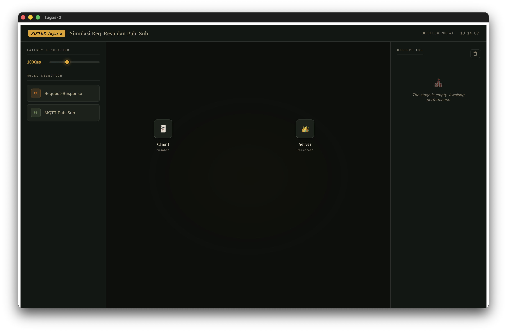

| **Model Komunikasi**   | 2 Model (RR dan Pub-Sub) |
| ---------------------- | ------------------------- |
| **Framework Backend**  | Rust + Tauri v2           |
| **Framework Frontend** | Vue 3 + Vite              |
| **Bahasa Frontend**    | JavaScript   |

### **1\. Pendahuluan**

#### **1.1 Tujuan Simulasi**

Simulasi ini dirancang untuk memberikan pemahaman praktis mengenai cara kerja dua model komunikasi yang berbeda dalam konteks sistem terdistribusi. Pengguna dapat mengamati, membandingkan, dan menganalisis perilaku masing-masing model secara real-time melalui antarmuka visual interaktif.

**Simulasi menjawab pertanyaan berikut:**

- Bagaimana aliran pesan berlangsung pada setiap model komunikasi?
- Apa perbedaan karakteristik antara komunikasi sinkron dan asinkron?
- Bagaimana sistem menangani antrean pesan dan toleransi terhadap beban tinggi?
- Kapan sebaiknya setiap model komunikasi diterapkan dalam sistem nyata?

#### **1.2 Latar Belakang**

Sistem terdistribusi modern - mulai dari aplikasi e-commerce, Internet of Things (IoT), hingga layanan streaming - mengandalkan berbagai model komunikasi antar komponen. Pemilihan model yang tepat secara langsung mempengaruhi performa, keandalan, dan skalabilitas sistem. Simulasi ini merepresentasikan skenario nyata di mana beragam node (client, server, broker, producer, consumer) saling bertukar data dengan karakteristik komunikasi yang berbeda-beda.

### **2\. Model Komunikasi yang Dipilih**

Simulasi mengimplementasikan dua model komunikasi yang merepresentasikan spektrum luas dari pola komunikasi dalam sistem terdistribusi:

#### **2.1 Request-Response (RR)**

**Kategori dalam Tugas**

Request-Response - sesuai dengan daftar model yang disebutkan dalam instruksi tugas.

Request-Response adalah pola komunikasi sinkron paling fundamental dalam sistem terdistribusi. Client mengirimkan permintaan (request) kepada server dan kemudian menunggu hingga server mengembalikan respons sebelum melanjutkan eksekusi.

**Karakteristik utama:**

- Sinkron: client memblokir eksekusi hingga respons diterima
- Pola 1:1 - satu pengirim, satu penerima
- Urutan pesan dijamin: setiap request mendapat satu response yang berkorespondensi
- Cocok untuk: operasi yang butuh hasil segera (query database, autentikasi)

Analogi dunia nyata: Seperti panggilan telepon - penelepon menunggu jawaban sebelum melanjutkan percakapan.

**Implementasi dalam simulasi:**

```
// Backend Rust - src-tauri/src/main.rs

# [tauri::command]
async fn send_request_response(id: String, latency: u64) -> Result&lt;String, String&gt; {

tokio::time::sleep(Duration::from_millis(latency)).await;

Ok(format!("response for request ID: {} latency: {}", id, latency))
}
```
Command Tauri di atas mensimulasikan latensi jaringan yang dapat dikonfigurasi pengguna, kemudian mengembalikan respons kepada client. Frontend menunggu (await) hingga respons diterima dan mencatat total waktu tempuh (round-trip time).

#### **2.2 Publish-Subscribe via MQTT (PS)**

**Kategori dalam Tugas**

Publish-Subscribe - sesuai dengan daftar model yang disebutkan dalam instruksi tugas. Diimplementasikan menggunakan protokol MQTT melalui library rumqttc.

Publish-Subscribe (Pub-Sub) adalah pola komunikasi asinkron di mana pengirim pesan (publisher) tidak mengirim langsung ke penerima. Sebaliknya, pesan dikirim ke sebuah broker, yang kemudian mendistribusikannya ke semua subscriber yang telah mendaftarkan diri pada topik tertentu.

**Karakteristik utama:**

- Asinkron: publisher tidak menunggu respons subscriber
- Pola 1:N - satu publisher, banyak subscriber secara bersamaan
- Decoupling tinggi: publisher dan subscriber tidak saling mengetahui identitas masing-masing
- Cocok untuk: notifikasi real-time, sensor IoT, sistem event-driven

Analogi dunia nyata: Seperti siaran radio - stasiun (publisher) mengirimkan sinyal tanpa tahu siapa yang mendengarkan; semua pendengar yang menyetel frekuensi yang sama (subscriber pada topik yang sama) menerima pesan secara bersamaan.

**Implementasi dalam simulasi:**
```
// Backend Rust - src-tauri/src/main.rs

# [tauri::command
async fn mqtt_publish(topic: String, message: String, latency: u64) -> Result&lt;(), String&gt; {

tokio::time::sleep(Duration::from_millis(latency)).await;

let mut mqttoptions = rumqttc::MqttOptions::new("tauri_publisher", "localhost", 1883);

mqttoptions.set_keep_alive(Duration::from_secs(5));

let (client, mut eventloop) = rumqttc::AsyncClient::new(mqttoptions, 10);

client.publish(topic, rumqttc::QoS::AtMostOnce, false, message).await.map_err(|e| e.to_string())?;

Ok(())
}
```

Visualisasi menampilkan Publisher mengirim ke Broker, yang kemudian meneruskan pesan secara simultan ke Subscriber 1 dan Subscriber 2, merepresentasikan sifat broadcasting dari Pub-Sub.


### **3\. Komponen Sistem Terdistribusi**

Sistem simulasi dibangun dari komponen-komponen berikut yang berinteraksi satu sama lain bergantung pada model komunikasi yang aktif:

| **Komponen**                  | **Peran**                                                                                                                                       | **Aktif pada Model**   |
| ----------------------------- | ----------------------------------------------------------------------------------------------------------------------------------------------- | ---------------------- |
| Client / Publisher / Producer | Node pengirim pesan atau permintaan. Bertindak sebagai inisiator komunikasi dalam semua model.                                                  | Semua model            |
| Server                        | Node penerima dalam Request-Response. Memproses request dan mengembalikan response kepada client.                                               | Request-Response       |
| Broker (MQTT)                 | Perantara dalam Pub-Sub. Menerima pesan dari publisher dan mendistribusikannya ke semua subscriber yang terdaftar pada topik yang sama.         | Pub-Sub (MQTT)         |
| Subscriber                    | Node penerima dalam Pub-Sub. Mendaftarkan diri pada topik tertentu dan menerima pesan secara pasif ketika broker meneruskannya.                 | Pub-Sub (MQTT)         |
| Tauri IPC Bridge              | Jembatan komunikasi antara proses frontend (Vue 3/WebView) dan backend (Rust). Semua invoke() melewati bridge ini.                              | Internal - semua model |

#### **3.1 Arsitektur Sistem**

Aplikasi menggunakan arsitektur dua proses yang dihubungkan oleh Tauri IPC:

- Proses Rust (Backend): menjalankan logika komunikasi, menyimpan state queue, dan mensimulasikan latensi jaringan menggunakan Tokio async runtime.
- Proses WebView (Frontend): menampilkan visualisasi topologi, mengirim perintah ke backend via invoke(), dan merender log event serta tabel perbandingan secara reaktif.

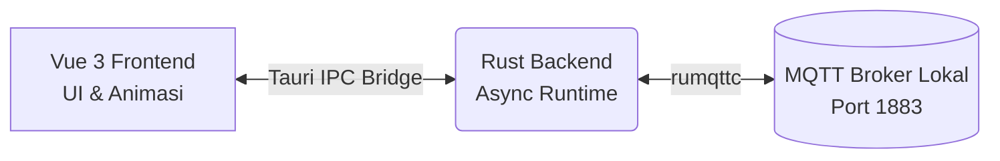

#### **3.2 Alur Komunikasi**

##### **3.2.1 Alur Komunikasi Model Request-Repsonse**
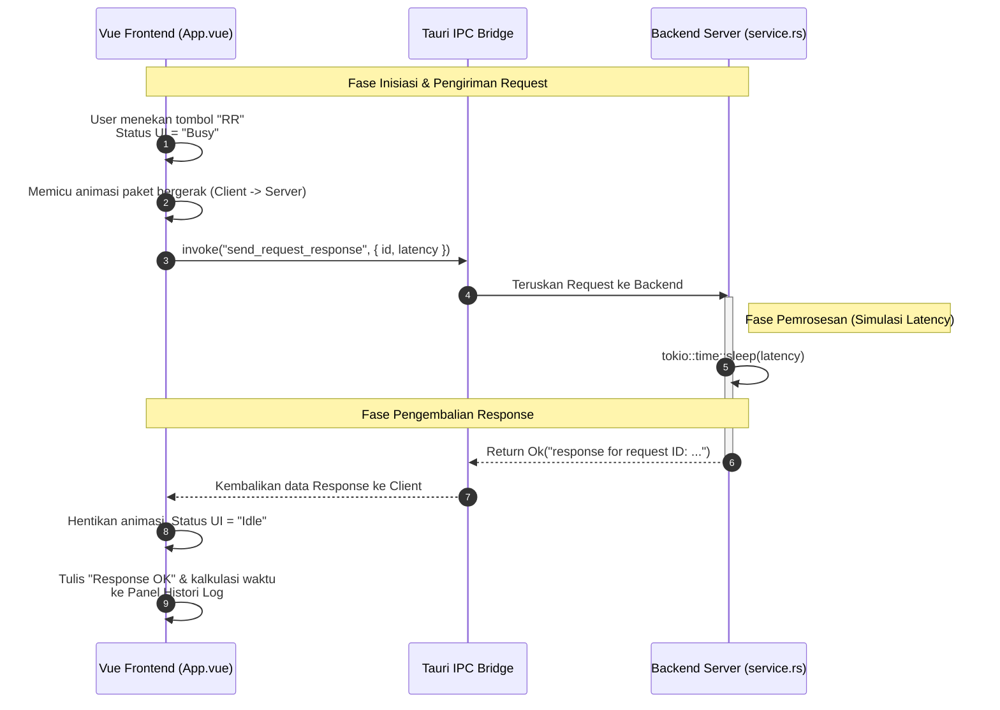
penjelasan dari alur komunikasi Model RR
- Inisiasi UI: Saat fungsi runRR() dipanggil, UI mengunci tombol (state isBusy = true) dan memulai animasi pergerakan data dari titik Client ke titik Server.
- Tauri IPC: UI memanggil fungsi invoke bawaan Tauri untuk mengirim ID unik dan durasi simulasi latency ke backend Rust.
- Proses Backend: Fungsi send_request_response di service.rs akan menunda eksekusi asinkron selama waktu latensi yang ditentukan (time::sleep). Ini mensimulasikan waktu pemrosesan dan waktu tempuh jaringan.
- Response: Setelah penundaan selesai, Rust mengembalikan string respons ke UI. UI kemudian menyudahi animasi dan mencatat total waktu siklusnya di Event Log.

##### **3.2.2 Alur Komunikasi Model Publish-Subscribe via MQTT**
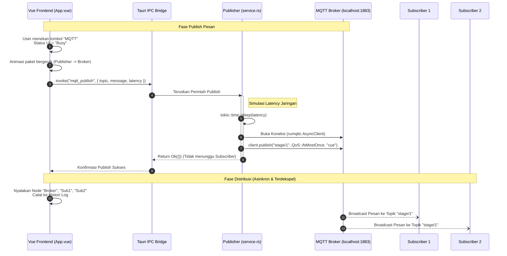
penjelasan dari alur komunikasi Model Pub-Sub
- Inisiasi UI: Fungsi runMQTT() dijalankan, mengunci UI, dan mengirim paket animasi dari node Publisher ke node Broker.
- Tauri IPC: UI mengirimkan topic, message, dan latency ke backend Rust.
- Proses & Publish Backend: Pada fungsi mqtt_publish di service.rs, backend melakukan jeda latensi terlebih dahulu. Kemudian, backend membuat instance client MQTT lokal (rumqttc) dan mengirim pesan (Publish) ke Broker (localhost:1883) dengan QoS 0 (AtMostOnce).
- Sifat Asinkron: Perhatikan bahwa pada langkah 7, Rust langsung merespons "Ok(())" ke Frontend setelah pesan dilempar ke Broker. Rust tidak pernah menunggu Subscriber membalas pesan.
- Distribusi Broker: Secara paralel (dan direpresentasikan secara visual oleh UI pada baris activeNodes.value = ["broker", "sub1", "sub2"]), Broker mem-broadcast pesan tersebut ke semua Subscriber yang listen pada topik stage/1.
### **4\. Cara Menjalankan dan Menggunakan Simulasi**

#### **4.1 Prasyarat**

- Rust toolchain (stable) - <https://rustup.rs>
- Node.js >= 18
- Tauri CLI v2: npm install -g @tauri-apps/cli
- MQTT Broker lokal untuk fitur Pub-Sub: mosquitto 

#### **4.2 Instalasi dan Menjalankan**
```
1. Clone repositori dan masuk ke direktori
git clone https://github.com/Najer-jril/Sister.git
cd Sister

2. Install dependensi frontend
npm install

3. Jalankan aplikasi dalam mode development
npm run tauri dev
```

#### **4.3 Panduan Interaksi Pengguna**

##### **Panel Kiri - Kontrol Simulasi**

<div align="center">
  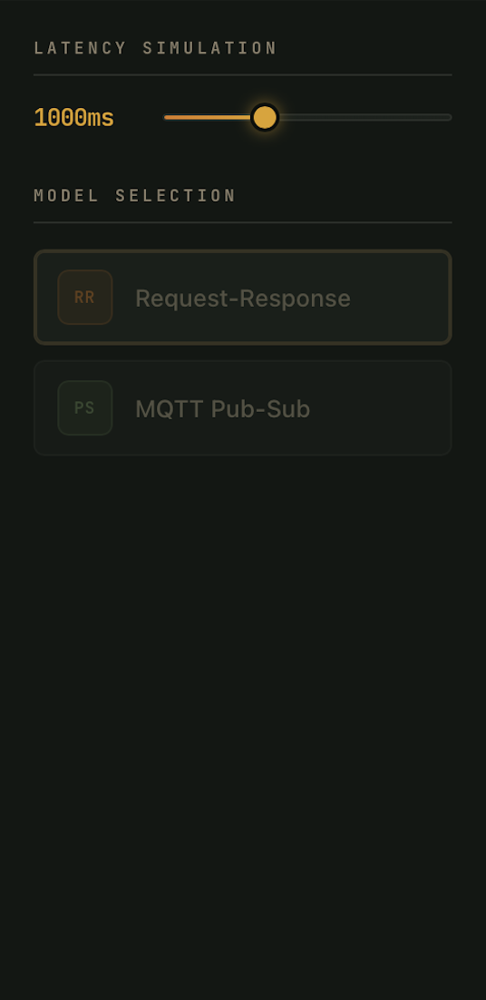
</div>

- Latency Slider: Atur latensi simulasi dari 0ms hingga 3000ms. Mengubah nilai ini mensimulasikan kondisi jaringan yang berbeda (cepat, lambat, atau sangat lambat).
- Model Selection: Klik salah satu dari dua tombol model (RR, PS) untuk beralih antara model komunikasi.

##### **Panel Tengah - Visualisasi Topologi**
1. Panel tengah untuk Model Request-Respons
<div align="center">
  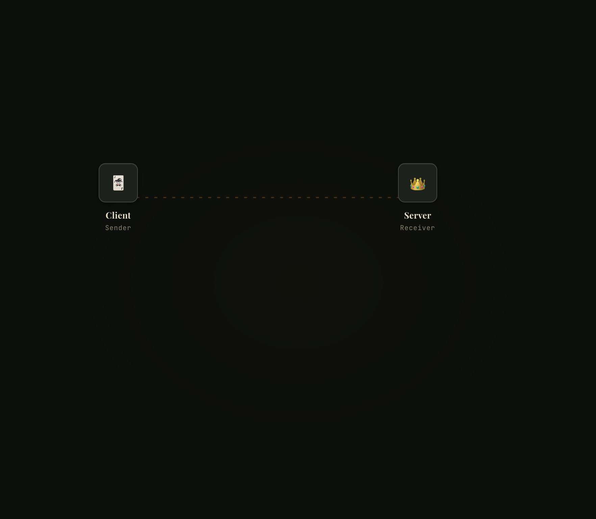
</div>

2. Panel tengah untuk Model Publish-Subscribe
<div align="center">
  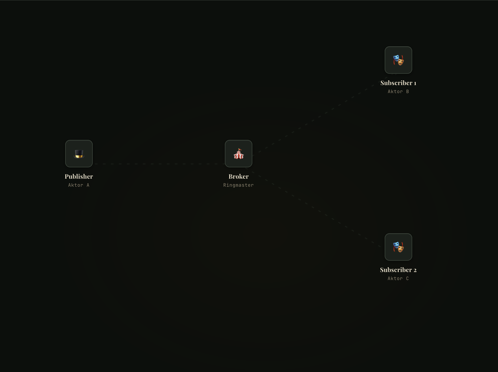
</div>

Penjelasan umum untuk keseluruhan model komunikasi:
- Canvas menampilkan node-node sistem dan aliran pesan antar node secara animasi.
- Garis koneksi beranimasi (dashed line bergerak) menunjukkan arah transmisi pesan yang sedang berlangsung.
- Node yang aktif ditandai dengan efek glow dan pulse ring.

##### **Panel Kanan - Event Log**

1. Log Request-Response
<div align="center">
  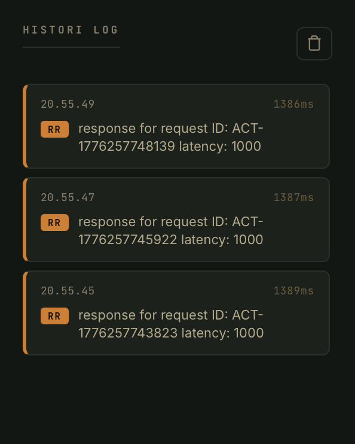
</div>

2. Log Publish-Subscribe
<div align="center">
  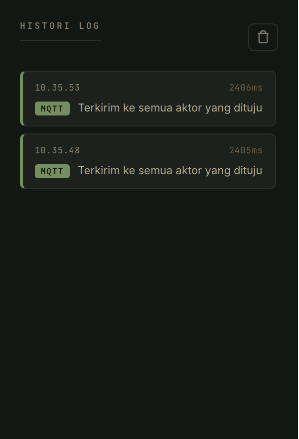
</div>

- Setiap event dicatat secara kronologis dengan timestamp, tag model, pesan, dan durasi.
- Warna border kiri log dibedakan per model: oranye (RR), hijau (PS).
- Tombol CLR mengosongkan log.

### **5\. Mekanisme Perbandingan Model Komunikasi**

Simulasi menyediakan beberapa mekanisme untuk membandingkan kedua model secara langsung:

#### **5.1 Tabel Perbandingan Karakteristik**

| **Metrik**       | **Request-Response**    | **Pub-Sub (MQTT)** |
| ---------------- | ----------------------- | ------------------ |
| Pola Komunikasi  | 1:1 Synchronous         | 1:N Asynchronous   |
| Urutan Pesan     | Dijamin (1 req = 1 res) | Tidak dijamin      |
| Coupling         | Tightly coupled         | Loosely coupled    |
| Toleransi Beban  | Rendah                  | Tinggi             |
| Durability Pesan | Tidak ada               | Tidak ada (QoS 0)  |
| Throughput       | Terbatas                | Tinggi             |
| Cocok untuk      | Query, Auth, API        | IoT, Notifikasi    |

#### **5.2 Metrik Dinamis Real-Time**

Tabel perbandingan di bagian bawah canvas memperbarui dua baris secara otomatis selama simulasi:

- Avg Latency: rata-rata durasi real (diukur dari performance.now() di frontend) untuk setiap model. Nilai ini mencerminkan latensi aktual termasuk overhead IPC Tauri, bukan hanya nilai slider.
- Total Calls: jumlah kumulatif invokasi tiap model selama sesi berlangsung.

#### **5.3 Event Log sebagai Alat Analisis**

Log event di panel kanan memungkinkan pengguna menganalisis urutan kejadian lintas model. Dengan menjalankan kedua model secara bergantian pada latency yang sama, pengguna dapat membandingkan:

- Apakah Request-Response selalu memiliki durasi lebih panjang karena menunggu round-trip?
- Apakah Pub-Sub menyelesaikan transmisi lebih cepat karena tidak menunggu acknowledgment subscriber?

### **6\. Relevansi Skenario Dunia Nyata**

Kedua model dalam simulasi ini langsung memetakan ke komponen-komponen dalam sistem e-commerce modern:

| **Model Simulasi** | **Analogi Sistem Nyata**                                                                                                                    | **Contoh Teknologi**                           |
| ------------------ | ------------------------------------------------------------------------------------------------------------------------------------------- | ---------------------------------------------- |
| Request-Response   | Customer checkout - frontend menunggu konfirmasi pembayaran dari payment gateway sebelum menampilkan halaman sukses.                        | REST API, gRPC                                 |
| Pub-Sub (MQTT)     | Setelah order dikonfirmasi, sistem mengirim notifikasi ke: layanan email, layanan SMS, layanan gudang - secara bersamaan tanpa saling tahu. | Apache Kafka, RabbitMQ (fanout), MQTT, AWS SNS |

Skenario ini menggambarkan mengapa sistem e-commerce skala besar menggunakan kombinasi kedua model: Request-Response untuk operasi yang butuh konfirmasi segera, Pub-Sub untuk distribusi event ke banyak layanan.

### **7\. Cara Menginterpretasi Hasil Simulasi**

#### **7.1 Membaca Topologi Canvas**

| No | **Elemen Visual**                  | **Yang sedang terjadi**                                                                 |
| - | ---------------------------------- | --------------------------------------------------------------------------- |
1 | Garis putus-putus bergerak         | Transmisi sedang berlangsung - semakin cepat latensi, semakin cepat animasi |
2 | Node bercahaya (glow + pulse ring) | Node sedang aktif memproses atau menerima pesan                             |
3 | Node memudar                       | Node idle - tidak terlibat dalam transmisi saat ini                         |

1. Garis putus-putus bergerak

<div align="center">
  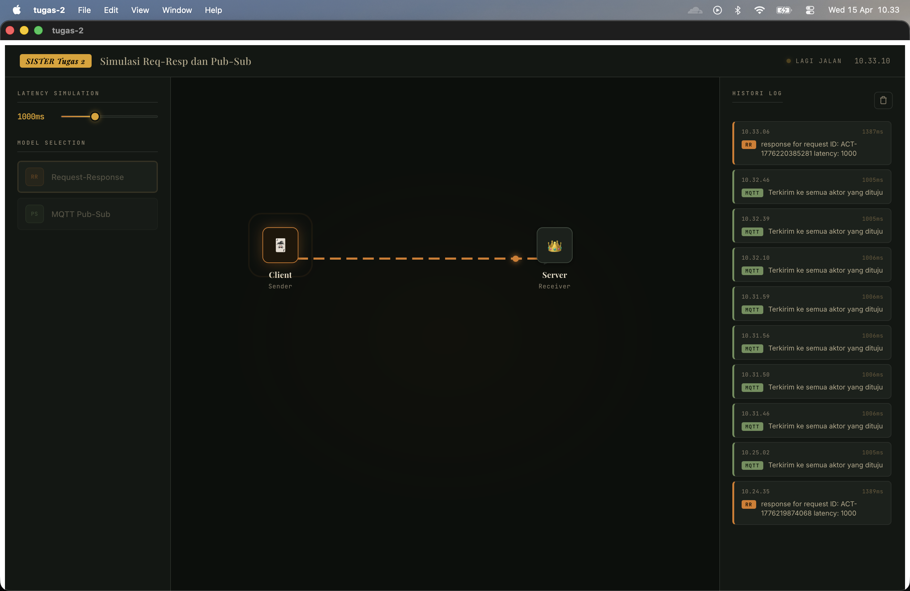
</div>

<div align="center">
  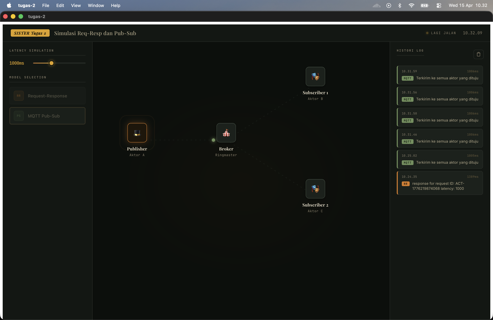
</div>

2. Node Bercahaya
<div align="center">
  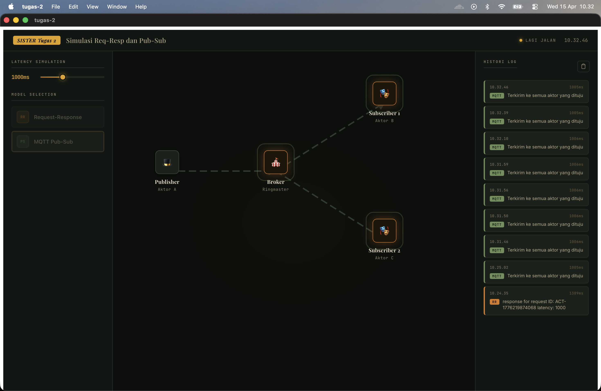
</div>

3. Node memudar
<div align="center">
  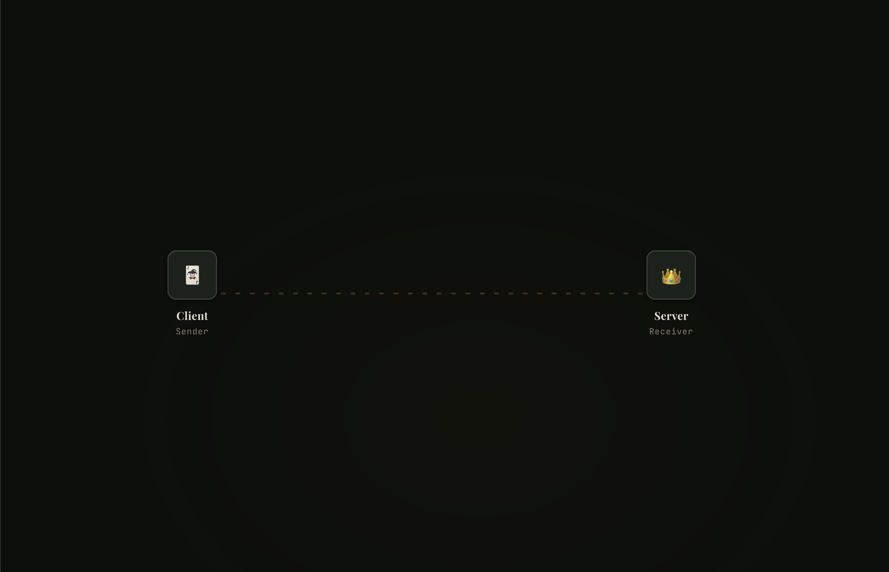
</div>


#### **7.2 Membaca Event Log**

Setiap baris log memiliki format: [timestamp\] | [TAG MODEL\] | [pesan\] | [durasi ms\]

seperti contoh :

<div align="center">
  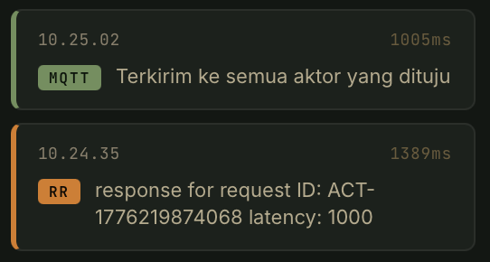
</div>

- Durasi pada Process mencerminkan waktu pemrosesan yang dikonfigurasi via latency slider.
- Durasi pada RR selalu > latency yang diset karena mencakup overhead round-trip (request + response) + overhead IPC Tauri.

#### **7.3 Eksperimen yang Dijalankan**

- Set latency ke 2000ms, jalankan RR - amati bahwa UI terblokir selama 2 detik (sinkron)

<div align="center">
  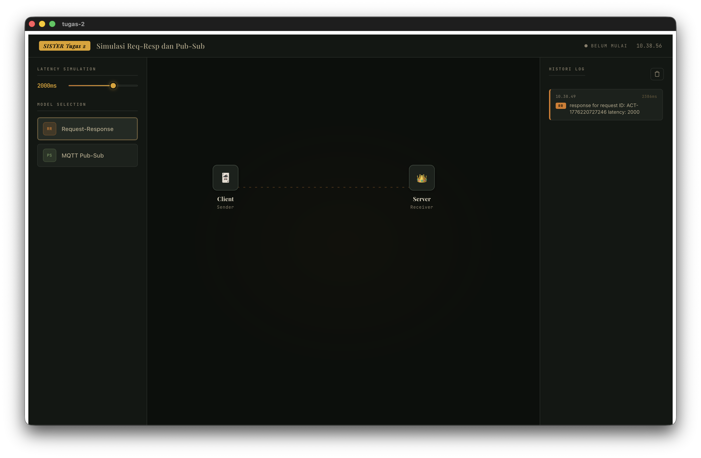
</div>

- Set latency ke 2000ms, jalankan MQTT - amati bahwa pesan terkirim tanpa menunggu subscriber merespons

<div align="center">
  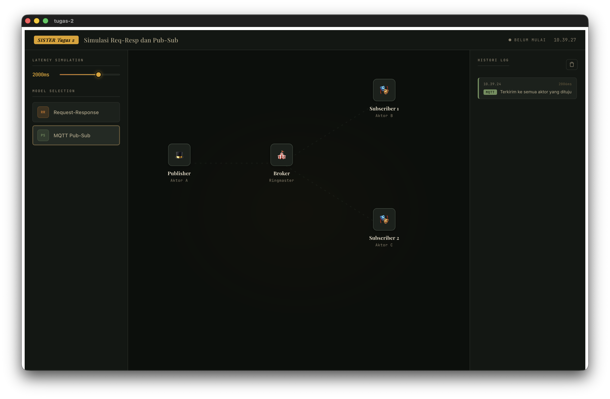
</div>

- Bandingkan Avg Latency antara RR dan MQTT pada latency yang sama - RR selalu lebih tinggi karena round-trip

model | konfigurasi latency | final duration
--- | ------ | -----
RR | 2000ms | 2386ms 
Pub-Sub | 2000ms | 2006ms

## **8\. Kesimpulan**

Simulasi ini berhasil mengimplementasikan dan memvisualisasikan dua model komunikasi yang mencakup spektrum utama pola komunikasi dalam sistem terdistribusi:

- Request-Response menunjukkan komunikasi sinkron yang sederhana namun terbatas dalam skalabilitas.
- Publish-Subscribe (MQTT) menunjukkan bagaimana decoupling antara publisher dan subscriber memungkinkan distribusi pesan ke banyak penerima secara efisien.
