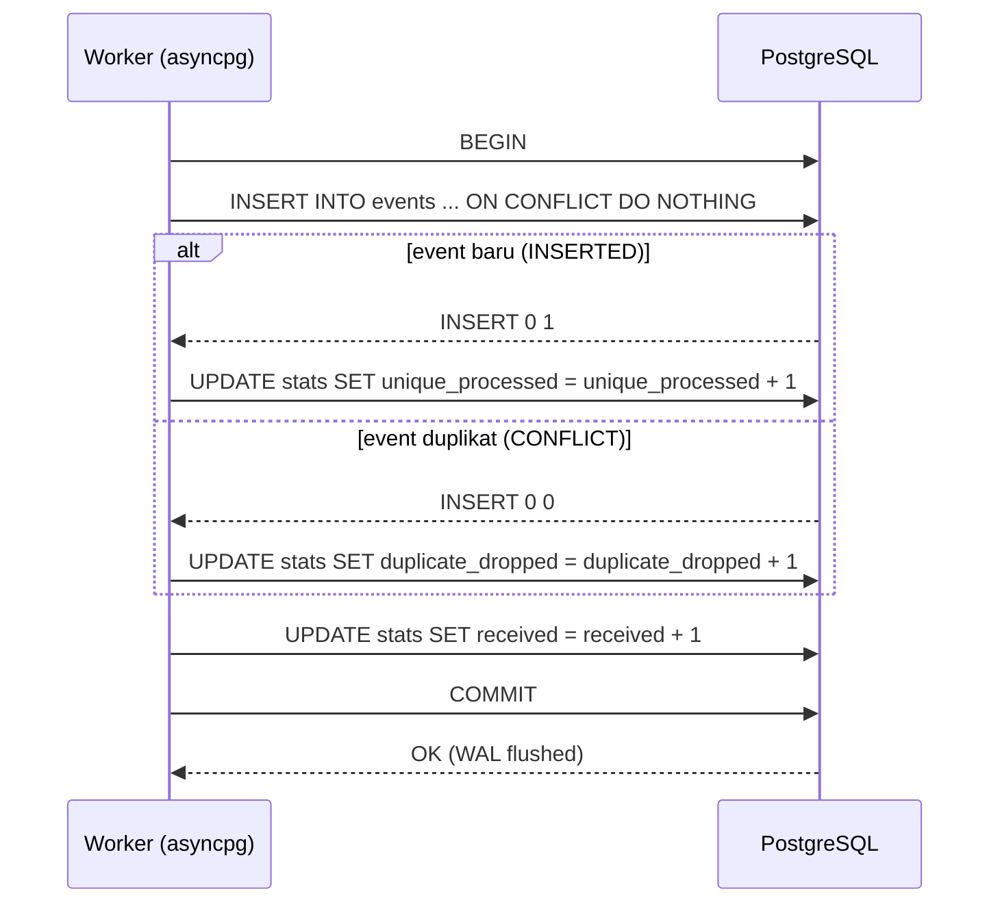
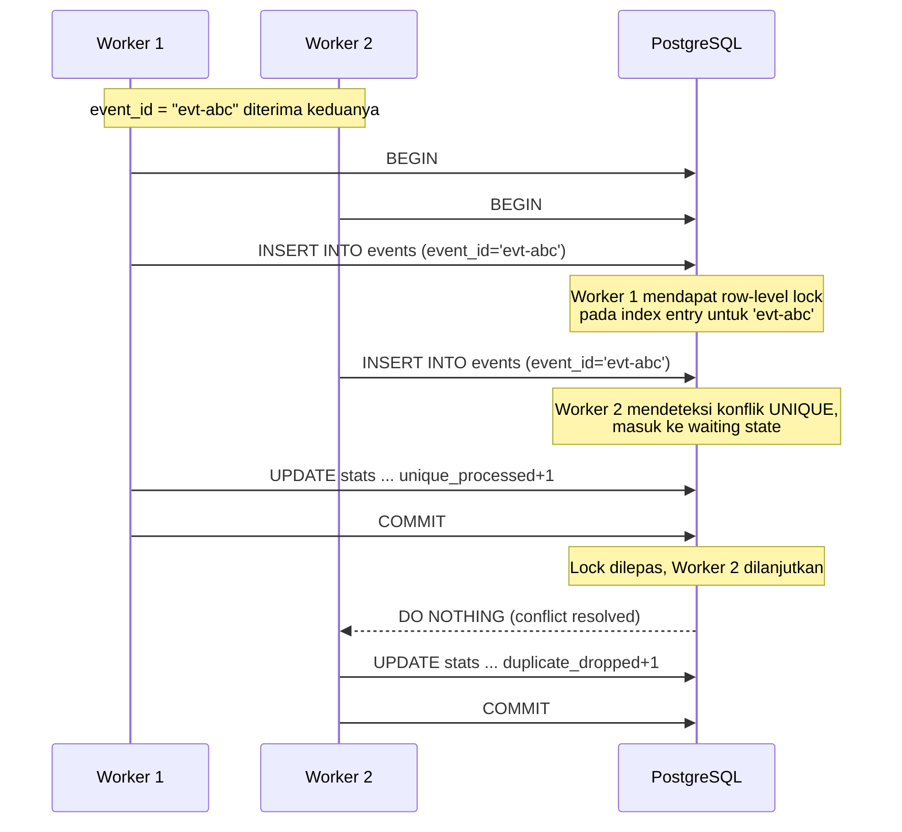

# Laporan Bagian Teori
## Pub-Sub Log Aggregator Terdistribusi dengan *Idempotent Consumer*, *Deduplication*, dan Kontrol Konkurensi

---

## T1. Karakteristik Sistem Terdistribusi dan Trade-off Desain

Sebuah sistem terdistribusi adalah kumpulan komponen otonom yang saling berkomunikasi melalui jaringan namun tampak bagi pengguna sebagai satu kesatuan yang koheren (Coulouris et al., 2012). Tiga karakteristik fundamental yang membedakannya dari sistem terpusat adalah *concurrency*, ketidakhadiran *global clock*, dan *independent failures*. *Concurrency* berarti banyak komponen—*publisher*, *broker*, dan instance *consumer*—dapat mengeksekusi operasi secara bersamaan, sehingga rentan terhadap *race condition* bila tidak dikendalikan. Tidak adanya *global clock* berarti setiap *node* memiliki jam lokal dengan *drift* dan *skew* yang berbeda, sehingga urutan kejadian antar-*node* tidak dapat ditentukan secara mutlak hanya dari *timestamp* fisik. *Independent failures* berarti setiap komponen—*broker* pesan, *consumer*, maupun *dedup store*—dapat gagal secara terpisah dan tidak dapat dideteksi seketika oleh komponen lain, sehingga kegagalan harus diasumsikan sebagai kondisi normal, bukan kondisi luar biasa.

Pada arsitektur *Pub-Sub Log Aggregator*, ketiga karakteristik ini melahirkan *trade-off* desain yang eksplisit: menerima kemungkinan duplikasi pesan akibat *retry* (mengorbankan efisiensi) demi menjamin keandalan pengiriman; menggunakan kombinasi *timestamp* dan *counter* sebagai pengganti *global clock* (mengorbankan presisi urutan mutlak); serta merancang *consumer* agar *idempotent* demi mentoleransi kegagalan parsial tanpa korupsi data agregat.

---

## T2. Pemilihan Arsitektur Publish–Subscribe dibanding Client–Server

Arsitektur *client–server* mensyaratkan *tight coupling* antara pemanggil dan penerima: klien harus mengetahui alamat server secara eksplisit, dan kedua pihak harus aktif pada saat yang bersamaan agar komunikasi berhasil (Coulouris et al., 2012). Model komunikasi tidak langsung (*indirect communication*) seperti *publish–subscribe* mengatasi keterbatasan ini melalui tiga bentuk *decoupling*: *space decoupling* (*publisher* tidak perlu mengetahui identitas *subscriber*), *time decoupling* (kedua pihak tidak perlu aktif bersamaan karena pesan dapat dibuffer oleh *broker*), dan *synchronization decoupling* (proses pengiriman tidak memblokir proses pengirim maupun penerima).

Untuk kasus *log aggregator*, ketiga bentuk *decoupling* tersebut memberikan keunggulan teknis yang konkret. *Scalability* meningkat karena jumlah *subscriber* (modul analitik, sistem *alerting*, *storage* arsip) dapat bertambah tanpa mengubah kode *publisher*. Penanganan *traffic spikes* menjadi lebih baik karena *broker* berfungsi sebagai *buffer* yang meratakan beban (*load leveling*), mencegah *producer* log kewalahan saat volume tiba-tiba melonjak. Sebaliknya, *client–server* murni akan memaksa *producer* menunggu respons sinkron dari setiap konsumen, yang tidak praktis ketika jumlah dan jenis konsumen log terus bertambah serta volume data bersifat *bursty*. Oleh karena itu, *publish–subscribe* dipilih sebagai fondasi arsitektur sistem ini.

---

## T3. *At-least-once* vs *Exactly-once Delivery* dan Peran *Idempotent Consumer*

Dalam komunikasi terdistribusi, semantik pengiriman pesan umumnya dikategorikan menjadi beberapa tingkat keandalan akibat kemungkinan kegagalan jaringan maupun proses (Coulouris et al., 2012). *At-least-once delivery* menjamin pesan pasti diterima, namun dengan konsekuensi pesan dapat terkirim lebih dari satu kali apabila *acknowledgment* hilang dan *publisher* atau *broker* melakukan *retry*. *Exactly-once delivery* idealnya menjamin setiap pesan diterima dan diproses tepat satu kali, tetapi secara teoretis sangat sulit dicapai pada sistem terdistribusi nyata karena kombinasi kegagalan jaringan, *crash* proses, dan ketidakpastian apakah *acknowledgment* benar-benar diterima sebelum atau setelah kegagalan terjadi.

Karena *exactly-once* pada lapisan transport hampir mustahil dijamin tanpa biaya koordinasi yang sangat mahal, sistem praktis—termasuk *Pub-Sub Log Aggregator* ini—memilih strategi *at-least-once delivery* yang dikombinasikan dengan *idempotent consumer* pada sisi aplikasi. *Idempotent consumer* adalah *consumer* yang dirancang sedemikian rupa sehingga memproses pesan yang sama berulang kali menghasilkan efek akhir yang identik dengan memproses sekali. Pola ini krusial karena memindahkan tanggung jawab penjaminan konsistensi dari lapisan jaringan (yang tidak dapat diandalkan) ke lapisan logika aplikasi (yang dapat dikendalikan), misalnya melalui pengecekan *event_id* terhadap *dedup store* sebelum efek samping permanen dieksekusi.

---

## T4. Skema Penamaan *Topic* dan *Event_id* untuk Deduplikasi

Penamaan yang konsisten dan unik adalah prasyarat agar entitas dalam sistem terdistribusi dapat dirujuk, ditemukan, dan dibedakan secara andal tanpa ambiguitas (Coulouris et al., 2012). Pada *Pub-Sub Log Aggregator*, terdapat dua kebutuhan penamaan yang berbeda perannya. Pertama, skema penamaan *topic* idealnya bersifat hierarkis dan deskriptif, misalnya `service.environment.log_level` (contoh: `order-service.prod.error`), agar *subscriber* dapat melakukan *filtering* atau *pattern matching* tanpa harus mengetahui struktur internal *publisher*.

Kedua, dan lebih kritis untuk kebutuhan deduplikasi, setiap pesan log memerlukan *event_id* yang unik secara global dan *collision-resistant*. Pendekatan yang umum digunakan adalah UUID versi 4 (acak, probabilitas kolisi dapat diabaikan) atau skema seperti ULID/Snowflake ID yang menggabungkan *timestamp*, identitas *node* atau *producer*, dan *sequence counter* lokal sehingga unik sekaligus dapat diurutkan secara kasar. *Event_id* inilah yang dijadikan *primary key* atau *unique constraint* pada *dedup store*: ketika *consumer* menerima pesan, ia memeriksa apakah *event_id* tersebut sudah pernah tercatat. Jika sudah, pesan diabaikan (efek deduplikasi); jika belum, pesan diproses dan *event_id* disimpan secara atomik. Keandalan skema ini bergantung penuh pada keunikan dan ketahanan kolisi dari mekanisme pembuatan *event_id*.

---

## T5. *Ordering* Praktis: *Timestamp* dan *Monotonic Counter*

Ketidakhadiran *global clock* pada sistem terdistribusi berarti urutan kejadian antar-*node* tidak dapat ditentukan murni dari jam fisik lokal, karena setiap jam memiliki *clock skew* dan *clock drift* yang berbeda (Coulouris et al., 2012). Solusi teoretis seperti *logical clock* (Lamport) atau *vector clock* dapat menangkap relasi *causal*, tetapi kompleksitas implementasinya seringkali tidak proporsional untuk kebutuhan praktis *log aggregator*.

Pendekatan praktis yang lebih umum digunakan adalah menggabungkan *wall-clock timestamp* dengan *monotonic counter* lokal per-*producer*—mirip prinsip *Hybrid Logical Clock* atau *Snowflake ID*—sehingga setiap pesan memperoleh kunci urut yang unik dan secara kasar selaras dengan waktu nyata, sekaligus tetap monoton meningkat selama proses *producer* tidak *restart*. Pendekatan ini memiliki dua batasan penting. Pertama, *counter* hanya menjamin urutan total di dalam satu proses/*producer*, bukan relasi *causal* antar-*producer* yang berbeda. Kedua, *clock skew* antar-*node* tetap dapat membuat dua pesan dari *producer* berbeda tampak *out-of-order* terhadap waktu kedatangan aktual di *broker*. Dampaknya, *aggregator* harus dirancang toleran terhadap kedatangan *out-of-order*—misalnya dengan menerapkan *watermark* atau jendela waktu toleransi (*grace period*) sebelum suatu agregasi periodik dianggap final, alih-alih mengasumsikan urutan kedatangan selalu mencerminkan urutan kejadian sebenarnya.

---

## T6. *Failure Modes* dan Strategi Mitigasi

Model kegagalan pada sistem terdistribusi diklasifikasikan menjadi beberapa jenis, antara lain *crash failure* (proses berhenti dan tidak merespons), *omission failure* (pesan gagal terkirim atau gagal diterima), *timing failure* (respons melewati batas waktu yang disepakati), dan dalam kasus ekstrem *arbitrary/Byzantine failure* (komponen berperilaku sembarang) (Coulouris et al., 2012). Pada *Pub-Sub Log Aggregator*, kegagalan yang paling relevan adalah *crash failure* pada *consumer* atau *broker*, serta *omission failure* berupa pesan atau *acknowledgment* yang hilang di jaringan.

Strategi mitigasi dirancang berlapis. *Retry logic* pada sisi *publisher* maupun *consumer* menjamin pesan yang gagal terkirim atau gagal diproses akan dicoba ulang, dikombinasikan dengan *exponential backoff* (dan idealnya *jitter*) agar percobaan ulang tidak serempak membanjiri sistem (*thundering herd*) saat terjadi gangguan masif. *Durable dedup store*—yaitu *dedup store* yang disimpan secara persisten di disk, bukan hanya di memori—memastikan riwayat *event_id* yang sudah diproses tidak hilang ketika *consumer* mengalami *crash* dan harus melakukan *crash recovery*. Setelah *restart*, *consumer* dapat melanjutkan pemrosesan dari titik aman terakhir tanpa mengulang efek samping yang sudah tercatat, karena pengecekan terhadap *dedup store* tetap berlaku meskipun proses sempat mati total.

---

## T7. *Eventual/Causal Consistency* pada *Aggregator*

Pada sistem terdistribusi yang mereplikasi atau memproses data secara konkuren, *strong consistency* (semua *node* selalu melihat data yang identik dan terbaru pada saat bersamaan) seringkali harus dikorbankan demi *availability* dan *performance*, melahirkan model konsistensi yang lebih lemah namun lebih praktis (Coulouris et al., 2012). *Eventual consistency* menjamin bahwa selama tidak ada pembaruan baru, seluruh replika atau *view* hasil agregasi pada akhirnya akan konvergen ke nilai yang sama, meskipun untuk sementara waktu dapat terjadi ketidaksesuaian. *Causal consistency* lebih ketat sedikit: operasi yang memiliki hubungan sebab-akibat (*causally related*) harus terlihat dalam urutan yang konsisten oleh semua pengamat, walaupun operasi yang tidak berkaitan dapat terlihat dalam urutan berbeda.

Pada *Pub-Sub Log Aggregator*, model yang realistis diterapkan adalah *eventual consistency*: hasil agregasi log (misalnya hitungan *error* per menit) boleh sedikit tertinggal atau sementara tidak sinkron antar-*replica consumer*, namun dijamin konvergen. Kombinasi *idempotency* dan *dedup* menjadi mekanisme pendukung utama konvergensi ini—karena setiap pesan, berapa kali pun di-*replay* atau diproses ulang akibat *retry*, hanya memberi efek satu kali terhadap *state* akhir, hasil agregasi akhir akan identik terlepas dari urutan kedatangan atau jumlah duplikasi yang terjadi selama proses berlangsung.

---
## T8. Bab 8: Transaksi dan Sifat ACID pada *Dedup Flow*

### 8.1 Konteks: Mengapa Transaksi Diperlukan

Pada sistem *Pub-Sub Log Aggregator* ini, setiap event yang masuk harus mengalami dua operasi tulis sekaligus: (1) menyimpan event ke tabel `events`, dan (2) memperbarui penghitung di tabel `stats`. Jika keduanya tidak bersifat atomik, maka *crash* di antara dua operasi tersebut akan mengakibatkan inkonsistensi — event tersimpan tetapi stats tidak tercatat, atau sebaliknya. Oleh karena itu, seluruh *dedup flow* dibungkus dalam satu transaksi PostgreSQL eksplisit menggunakan `asyncpg`.

### 8.2 Implementasi Transaksi: `processor.py`

Kode inti transaksi berada di [aggregator/src/consumer/processor.py](aggregator/src/consumer/processor.py):

```python
async def process_event(pool: asyncpg.Pool, event: EventIn) -> ProcessResult:
    async with pool.acquire() as conn:
        async with conn.transaction():           # ← BEGIN
            result = await conn.execute(
                """
                INSERT INTO events (topic, event_id, timestamp, source, payload)
                VALUES ($1, $2, $3, $4, $5::jsonb)
                ON CONFLICT (topic, event_id) DO NOTHING
                """,
                event.topic, event.event_id,
                event.timestamp, event.source, event.payload,
            )
            inserted = result == "INSERT 0 1"

            if inserted:
                await conn.execute(
                    "UPDATE stats SET received = received + 1, "
                    "unique_processed = unique_processed + 1 WHERE id = 1"
                )
            else:
                await conn.execute(
                    "UPDATE stats SET received = received + 1, "
                    "duplicate_dropped = duplicate_dropped + 1 WHERE id = 1"
                )
            return ProcessResult.PROCESSED if inserted else ProcessResult.DUPLICATE
                                             # ← COMMIT (otomatis saat keluar blok)
```

Satu `conn.transaction()` melingkupi dua `conn.execute()` — menjamin keduanya commit atau rollback bersama.

### 8.3 Pemetaan Sifat ACID ke Rancangan

```
┌─────────────────────────────────────────────────────────────────────────────────┐
│  ACID Property    Mekanisme dalam rancangan ini                                 │
├─────────────────────────────────────────────────────────────────────────────────┤
│  Atomicity        async with conn.transaction() → INSERT + UPDATE stats         │
│                   berhasil bersama atau rollback bersama                        │
├─────────────────────────────────────────────────────────────────────────────────┤
│  Consistency      UNIQUE (topic, event_id) + CHECK (id = 1) pada stats          │
│                   → constraint mencegah data berada di state yang tidak valid   │
├─────────────────────────────────────────────────────────────────────────────────┤
│  Isolation        READ COMMITTED (default PostgreSQL) — cukup karena dedup      │
│                   dikendalikan constraint, bukan read-then-check di aplikasi    │
├─────────────────────────────────────────────────────────────────────────────────┤
│  Durability       PostgreSQL flush WAL ke disk sebelum ACK commit               │
│                   Redis: appendonly yes + appendfsync everysec untuk antrian    │
└─────────────────────────────────────────────────────────────────────────────────┘
```

**Atomicity** dibuktikan oleh test `test_atomic_stats_no_lost_update` ([tests/test_transactions.py](tests/test_transactions.py)): 200 event unik diproses secara konkuren, dan hasilnya selalu `received == unique_processed == 200` tanpa selisih satu pun.

**Consistency** dijaga oleh skema di [aggregator/src/database.py](aggregator/src/database.py):

```sql
CONSTRAINT uq_topic_event_id UNIQUE (topic, event_id)   -- mencegah duplikasi event
CHECK (id = 1)                                           -- stats hanya boleh punya satu baris
```

**Durability** pada lapisan antrian diperkuat oleh konfigurasi Redis di [docker-compose.yml](docker-compose.yml):

```yaml
command: redis-server --appendonly yes --appendfsync everysec
```

### 8.4 *Isolation Level*: Mengapa READ COMMITTED Cukup

Pemilihan `READ COMMITTED` (bukan `REPEATABLE READ` atau `SERIALIZABLE`) adalah keputusan desain yang disengaja. Tabel berikut menunjukkan analisis anomali konkurensi yang relevan:

| Anomali | Terjadi? | Alasan |
|---|---|---|
| *Dirty read* | Tidak | READ COMMITTED secara definisi mencegah membaca data yang belum commit |
| *Lost update* pada `stats` | Tidak | `received = received + 1` adalah *atomic read-modify-write* di sisi SQL, bukan Python |
| *Phantom read* pada dedup | Tidak | UNIQUE constraint menangani konflik insert tanpa perlu *predicate lock* |
| *Write skew* | Tidak | Update `stats` hanya menyentuh satu baris (`id = 1`), tidak ada *multi-row invariant* yang bisa rusak |

`SERIALIZABLE` menambahkan overhead SSI (*Serializable Snapshot Isolation*) berupa *predicate locking* dan *conflict detection* yang tidak memberikan manfaat untuk pola ini, sehingga tidak digunakan.

### 8.5 *Lost-Update Prevention*: SQL Arithmetic vs Python Read-Modify-Write

Ini adalah salah satu keputusan paling kritis dalam rancangan. Perbandingan dua pendekatan:

```sql
-- ✓ BENAR: atomic di sisi database
UPDATE stats SET received = received + 1 WHERE id = 1;

-- ✗ SALAH: race condition di sisi Python
row = await conn.fetchrow("SELECT received FROM stats")
await conn.execute("UPDATE stats SET received = $1", row["received"] + 1)
```

Diagram berikut mengilustrasikan mengapa pendekatan Python salah (*lost update*):

```
Waktu →
Worker A: SELECT received=100 ─────────────────────────── UPDATE SET received=101
Worker B:                     SELECT received=100 ──── UPDATE SET received=101
                                                                             ↑
                                                               Nilai 101, bukan 102!
                                                               (satu increment hilang)
```

Dengan `received = received + 1` di SQL, PostgreSQL mengevaluasi ekspresi itu *di dalam* mesin database setelah mendapat *row-level lock*, sehingga dua worker yang berjalan bersamaan akan selalu menghasilkan `received + 2`, bukan kehilangan satu increment.

### 8.6 Diagram Alur Transaksi



---

## T9. Bab 9: Kontrol Konkurensi

### 9.1 Konteks: 4 Worker Konkuren Terhadap Satu Database

Sistem ini menjalankan `NUM_WORKERS = 4` coroutine asyncio secara bersamaan (dikonfigurasi di [docker-compose.yml](docker-compose.yml) dan [aggregator/src/config.py](aggregator/src/config.py)). Setiap worker melakukan `BLPOP` dari antrian Redis lalu memanggil `process_event()` secara mandiri. Artinya, empat transaksi PostgreSQL dapat berjalan paralel kapan saja. Rancangan kontrol konkurensi harus menjamin tidak ada *race condition*, *deadlock*, maupun *lost update* pada kondisi ini.

### 9.2 Arsitektur Konkurensi: Worker Pool

```mermaid
graph TD
    Redis["Redis Queue<br/>(event_queue)"]
    W0["Worker 0"]
    W1["Worker 1"]
    W2["Worker 2"]
    W3["Worker 3"]
    Pool["asyncpg Connection Pool<br/>(min=2, max=10)"]
    PG["PostgreSQL<br/>(events + stats)"]

    Redis -->|BLPOP| W0
    Redis -->|BLPOP| W1
    Redis -->|BLPOP| W2
    Redis -->|BLPOP| W3
    W0 -->|acquire()| Pool
    W1 -->|acquire()| Pool
    W2 -->|acquire()| Pool
    W3 -->|acquire()| Pool
    Pool -->|transaction| PG
```

Setiap worker mendapat koneksi dari pool (`pool.acquire()`) secara independen. Pool dikonfigurasi dengan `max_size=10`, sehingga hingga 10 koneksi paralel dapat aktif tanpa antrian, sementara konfigurasi `NUM_WORKERS=4` berarti dalam keadaan normal hanya 4 koneksi yang aktif bersamaan.

### 9.3 UNIQUE Constraint sebagai *Implicit Lock* untuk Dedup

Mekanisme paling penting adalah `CONSTRAINT uq_topic_event_id UNIQUE (topic, event_id)` yang dideklarasikan di [aggregator/src/database.py](aggregator/src/database.py). Ketika dua worker secara bersamaan menerima event dengan `event_id` yang sama (skenario duplikasi dari *publisher*), berikut yang terjadi di dalam PostgreSQL:



Pola ini disebut *implicit locking via constraint*: tidak ada `SELECT FOR UPDATE` atau `LOCK TABLE` eksplisit di kode aplikasi, namun PostgreSQL sendiri mengelola serialisasi insert yang berkonflik melalui mekanisme internal constraint enforcement.

### 9.4 MVCC: Mengapa Reader Tidak Memblokir Writer

PostgreSQL menggunakan *Multi-Version Concurrency Control* (MVCC). Setiap transaksi melihat *snapshot* database pada saat `BEGIN`, bukan data "live" yang mungkin sedang diubah oleh transaksi lain:

```
Snapshot W1 (t=100): events = [A, B, C]
Snapshot W2 (t=101): events = [A, B, C]

W1 INSERT D → versi baru tuple D dibuat, tidak terlihat W2 sampai W1 COMMIT
W2 SELECT * FROM events → masih melihat [A, B, C] (snapshot-nya sendiri)
W1 COMMIT → tuple D menjadi visible bagi transaksi baru
```

Konsekuensinya, endpoint `GET /events` yang membaca tabel events tidak pernah memblokir worker yang sedang menulis, dan sebaliknya. Ini adalah keunggulan MVCC dibanding *lock-based concurrency control* tradisional.

### 9.5 `INSERT ... ON CONFLICT DO NOTHING` sebagai *Compare-and-Set* Atomik

Pola upsert ini adalah inti dari *idempotent write*:

```sql
INSERT INTO events (topic, event_id, timestamp, source, payload)
VALUES ($1, $2, $3, $4, $5::jsonb)
ON CONFLICT (topic, event_id) DO NOTHING
```

Tidak ada *window* antara "cek apakah event sudah ada" dan "insert event" — operasi cek dan insert adalah satu operasi atomik di level mesin database. Bandingkan dengan pola naif yang rentan *race condition*:

```
┌──────────────────────────────────────────────────────────────────┐
│  POLA NAIF (RACE CONDITION):                                     │
│                                                                  │
│  W1: SELECT COUNT(*) WHERE event_id='X' → 0                     │
│                                 ↕ race window                   │
│  W2: SELECT COUNT(*) WHERE event_id='X' → 0 (W1 belum insert)   │
│  W1: INSERT event_id='X' → OK                                    │
│  W2: INSERT event_id='X' → OK ← DUPLIKASI LOLOS!               │
│                                                                  │
│  POLA RANCANGAN INI (AMAN):                                      │
│                                                                  │
│  W1: INSERT ON CONFLICT DO NOTHING → INSERT 0 1 (sukses)        │
│  W2: INSERT ON CONFLICT DO NOTHING → INSERT 0 0 (conflict)      │
│      (PostgreSQL serialize via constraint, tidak ada race window) │
└──────────────────────────────────────────────────────────────────┘
```

### 9.6 Bukti Empiris: Hasil Test Suite

Test `test_idempotent_under_concurrent_workers` di [tests/test_dedup.py](tests/test_dedup.py) mengirim 20 coroutine concurrent dengan `event_id` yang identik:

```python
results = await asyncio.gather(
    *[process_event(db_pool, event) for _ in range(20)]
)
# Hasil:
assert processed == 1      # hanya satu yang lolos INSERT
assert duplicates == 19    # 19 lainnya kena DO NOTHING
assert row["unique_processed"] == 1
assert row["duplicate_dropped"] == 19
```

Test `test_concurrent_workers_no_double_process` di [tests/test_transactions.py](tests/test_transactions.py) menguji 100 event (50 unik + 50 duplikat) secara konkuren:

```python
results = await asyncio.gather(
    *[process_event(db_pool, make_event(eid)) for eid in all_ids]
)
assert processed == 50
assert row["received"] == 100
assert row["unique_processed"] == 50
assert row["duplicate_dropped"] == 50
```

Test `test_stats_consistency_under_load` menguji 1000 event dengan 300 duplikat dan memverifikasi invariant:

```python
assert row["received"] == row["unique_processed"] + row["duplicate_dropped"]
assert row["received"] == 1000
```

Invariant ini selalu terpenuhi karena setiap path dalam transaksi (baik `PROCESSED` maupun `DUPLICATE`) selalu mengincrementasi `received` tanpa pengecualian.

### 9.7 Tidak Ada Deadlock: Analisis Urutan Lock

Potensi *deadlock* terjadi ketika dua transaksi mengunci resource dalam urutan yang saling bersilangan. Dalam rancangan ini:

```
Setiap transaksi selalu mengikuti urutan lock yang sama:
  1. Row-level lock pada tuple events (via INSERT constraint check)
  2. Row-level lock pada tuple stats (id = 1)

Karena urutan akuisisi lock SELALU 1 → 2 untuk semua worker,
tidak ada siklus tunggu yang dapat membentuk deadlock.
```

Selain itu, PostgreSQL sendiri memiliki *deadlock detector* yang akan membatalkan salah satu transaksi jika deadlock terdeteksi, namun kondisi tersebut tidak pernah terjadi dalam desain ini karena setiap transaksi hanya menyentuh satu baris di `events` (baris baru) dan satu baris tetap di `stats` (`id = 1`).

### 9.8 Ringkasan Keputusan Desain Konkurensi

| Keputusan | Alternatif yang Ditolak | Alasan Pemilihan |
|---|---|---|
| UNIQUE constraint sebagai dedup | `SELECT` lalu `INSERT` di aplikasi | Mengeliminasi *race window*, tidak perlu explicit lock |
| `received + 1` di SQL | Baca-ubah-tulis di Python | Atomic di engine, tidak ada *lost update* |
| READ COMMITTED | SERIALIZABLE | Cukup untuk pola ini, overhead SSI tidak diperlukan |
| asyncpg connection pool | Satu koneksi per worker | Efisiensi; pool mengelola lifecycle koneksi |
| asyncio concurrent tasks | Thread pool | GIL-free I/O, cocok untuk *I/O-bound workload* seperti DB calls |

---

## T10. Orkestrasi *Docker Compose*, Isolasi Jaringan, Persistensi, dan *Observability*

Pengelolaan sekumpulan layanan terdistribusi yang saling bergantung memerlukan mekanisme penamaan, penemuan lokasi (*service discovery*), dan kontrol akses jaringan yang konsisten agar sistem tetap dapat dikelola dan aman, prinsip yang relevan dengan pembahasan *naming* dan keamanan pada sistem terdistribusi (Coulouris et al., 2012). *Docker Compose* mengoperasionalkan prinsip-prinsip tersebut pada skala lokal/*development*. Setiap *service* (*broker*, *producer*, *consumer*, *dedup store*) didefinisikan sebagai *container* terpisah yang saling menemukan melalui nama *service* (analog dengan *naming service*), bukan alamat IP statis.

Isolasi jaringan diterapkan melalui *bridge network* khusus yang dibuat oleh *Compose*, memastikan komunikasi antar-*container* hanya terjadi di dalam jaringan virtual tersebut dan tidak terekspos ke luar kecuali *port* yang secara eksplisit dipetakan (*port mapping*)—mengurangi permukaan serangan (*attack surface*) sejalan dengan prinsip keamanan jaringan. Persistensi data, khususnya untuk *dedup store* dan basis data agregat, diwujudkan melalui *volume* yang menjamin data tetap ada meskipun *container* dihentikan atau diganti, mendukung kebutuhan *durable dedup store* yang dibahas pada T6.

*Observability* operasional diimplementasikan melalui *health check*: *liveness probe* mendeteksi apakah suatu *container* masih berjalan (dan perlu di-*restart* jika tidak), sementara *readiness probe* mendeteksi apakah *service* sudah siap menerima *traffic* (misalnya *broker* sudah selesai inisialisasi). Kombinasi `depends_on` dengan kondisi `service_healthy` pada *Compose* mengoordinasikan urutan *startup* antar-*service*, mencegah *consumer* mencoba terhubung ke *broker* yang belum siap.

---

**Daftar Pustaka**

Coulouris, G., Dollimore, J., Kindberg, T., & Blair, G. (2012). *Distributed systems: Concepts and design* (5th ed.). Addison-Wesley.